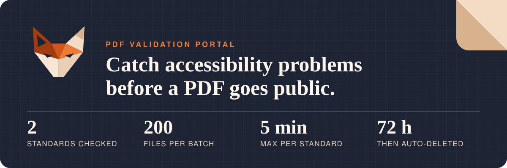
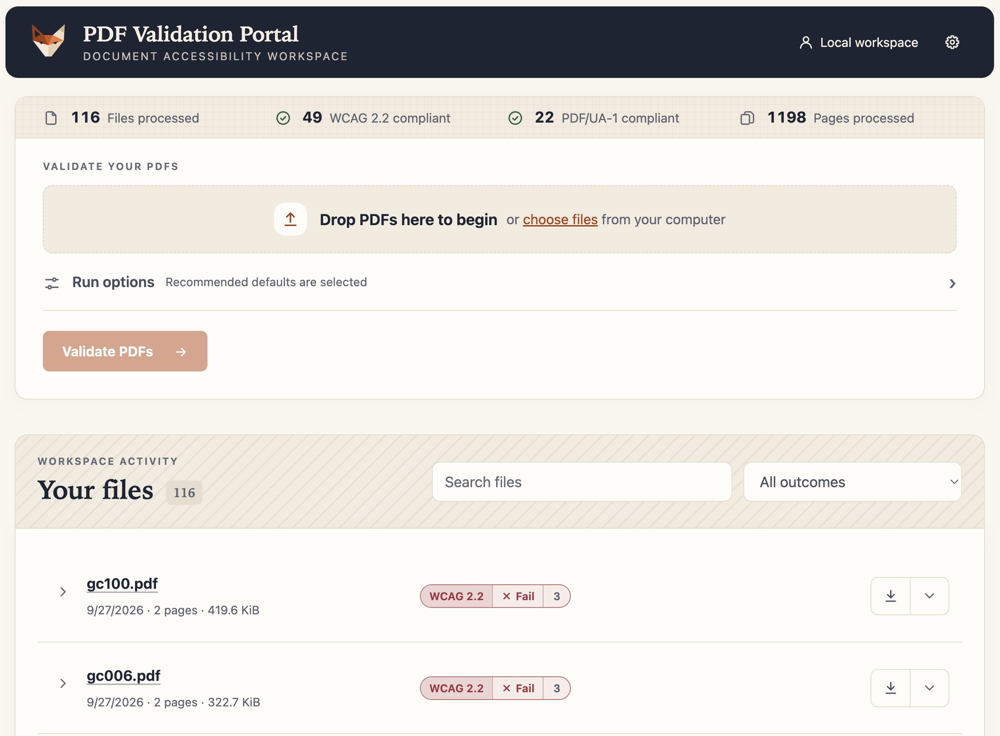
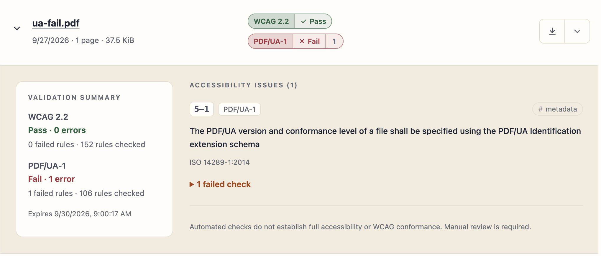

**Bottom line:** staff drop in PDFs and, within minutes, see whether each one meets **PDF/UA-1** and **WCAG 2.2**, which rule every problem breaks, and where it is in the document. Files stay private to the person who uploaded them and are deleted after 72 hours.

> [!WARNING]
> **A pass is not a sign-off.** Automated checks do not establish full accessibility or WCAG conformance. Manual review is required. This service does not remediate documents.

## See it

Every issue is grouped by standard and clause, with the exact failed check:

## FAQ

<b>Is our content safe?</b>

Staff sign in with Microsoft Entra ID and see only their own documents. PDFs upload straight into private Azure storage with a short-lived grant for that one file, and an exact copy is frozen before it is checked. Everything becomes inaccessible after 72 hours; users can delete it sooner. [How it works →](docs/how-it-works.md#security)

<b>How much can it handle?</b>

Up to 200 files (2 GiB) per upload from the browser, 200 MiB per file. By default four validations run at once, each in its own isolated job, with a five-minute limit per standard. [Capacity →](docs/how-it-works.md#performance-and-capacity)

<b>Can other systems use it?</b>

Yes. The portal itself uses the same versioned API that approved integrations call. See the [API guide](docs/api.md), the [PHP SDK](sdk/php/README.md), the [Python client](scripts/validate.py), and [external client setup](docs/azure-api.md).

<b>What does it take to deploy?</b>

An Azure subscription and Entra ID. A GitHub Actions workflow provisions Azure Container Apps, Storage and monitoring, then deploys. Creating this project provisions nothing by itself. [Azure resources →](docs/how-it-works.md#azure-resources) · [Deploy to Azure →](docs/azure-ci.md)

<b>How do we know it works?</b>

The [verification record](docs/verification.md) lists every test run, including automated accessibility checks of the portal, and what hasn't been run in Azure yet.

## Go deeper

**[Using the portal](docs/user-guide.md)** · **[How it works](docs/how-it-works.md)** · **[Development and testing](docs/development.md)** · **[API guide](docs/api.md)** · **[Deploy to Azure](docs/azure-ci.md)** ([manual](docs/azure-manual.md)) · **[Verification](docs/verification.md)** · [Attribution](licenses/NOTICE.md)

Engineers can try it locally with `docker compose up --build -d`, then open http://127.0.0.1:8000.
