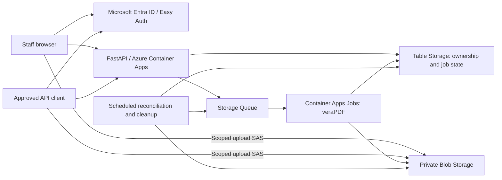

# PDF Validation Portal

A private PDF accessibility validation workspace and asynchronous API built for Azure. FastAPI serves the portal and API; isolated Java/veraPDF jobs validate each uploaded PDF against PDF/UA-1 and the vendored custom WCAG 2.2 profile.

**Automated checks do not establish full accessibility or WCAG conformance. Manual review is required.** This service does not remediate documents.

## Run locally

Requirements: Docker Engine with Compose. The local service binds to loopback and uses an explicit development identity; production rejects development authentication.

```sh
docker compose up --build -d
```

Open [the portal](http://127.0.0.1:8000) or [API documentation](http://127.0.0.1:8000/docs). The local development identity is always signed in, so [the sign-in page](http://127.0.0.1:8000/login) is shown only as a preview. The Compose stack includes Azurite, storage initialization, API, worker, and maintenance. First build downloads the checksum-verified veraPDF 1.30.2 installer. Stop with `docker compose down`; append `-v` only to erase local emulator data.

Limits: 200 files and 2 GiB per portal selection, 200 MiB per file. The API creates one document per request; multi-file selection is coordinated by the portal. Upload reservations expire after one hour. Submitted files and reports become inaccessible after 72 hours. Users can delete them sooner. Cleanup runs every two minutes in Azure (every 30 seconds locally); deletion tombstones persist beyond outstanding upload grants/worker leases to catch late writes.

## Architecture



- Azure Entra Easy Auth handles browser sessions and integration token validation. Visitors without an authorized session see only the `/login` sign-in page; the server withholds the workspace page until they sign in. The portal uses server-directed sign-in and the same versioned API as integrations. Upload requests use metadata only; PDFs go directly to Blob Storage. An owner-protected endpoint streams the submitted snapshot for viewing in a new tab.
- Files upload to private blobs with short-lived, per-blob write grants. Submission checks the actual size/signature and pins an immutable snapshot before queueing. Original filenames are display metadata, never blob paths or shell arguments.
- ETag claims and attempt-specific report paths prevent duplicate messages, stale workers, and deletion races from publishing the wrong result. Queue delivery is at least once, not exactly once.
- Each queued document is its own durable outbox. Maintenance retries undispatched work and recovers expired worker leases. Maximum three processing attempts for infrastructure failures; deterministic validation failures are not retried.
- Every file produces separate profile results. A processing error is distinct from a nonconforming PDF, and a successful profile report survives another profile's failure.
- One worker processes one PDF and runs profiles sequentially. Azure starts with at most four executions, each 2 vCPU/4 GiB, a 2 GiB JVM heap, five minutes per profile, and a 20 MiB combined stdout/stderr limit per profile.

## Develop and verify

```sh
python3.12 -m venv .venv
. .venv/bin/activate
pip install -r requirements.lock
pip install --no-deps -e .
npm ci --prefix frontend
npm run build --prefix frontend
cp .env.example .env
# Set PDF_VERAPDF_JAR in .env to the official installed CLI jar.
docker compose up -d azurite
python scripts/init_storage.py
uvicorn portal.app:create_app --factory --host 127.0.0.1 --port 8000 --no-access-log
# Separate terminals: pdf-worker --loop; pdf-maintenance --loop
```

For frontend hot reload, run `npm run dev --prefix frontend` and use `http://127.0.0.1:5173`. Stop the Compose API first if using the Python API on port 8000. The frontend supports Chrome and Edge 123, Safari 17.5, and Firefox 120 or later: its colors use CSS `light-dark()`, and its scripts target ES2022.

```sh
ruff check src tests scripts
ruff format --check src tests scripts
pytest -q -m 'not integration'
RUN_AZURE_INTEGRATION=1 pytest -q -m integration
cd frontend
npx playwright install chromium
npm test
```

The real-engine tests skip when `PDF_VERAPDF_JAR` is unavailable. The emulator test requires running Azurite and a real engine. CI runs the application tests inside the production Python 3.12/Java container, plus emulator and browser acceptance tests. See [verification results](docs/verification.md) for what was actually run in this workspace.

## Deploy

See [Azure deployment](docs/azure.md) for Entra registration, infrastructure, permissions, OIDC deployment, observability, and smoke tests. Deployment templates and workflows are included; no Azure resources are provisioned by creating this project.

See [API guide](docs/api.md), [Python client](scripts/validate.py), and [attribution](licenses/NOTICE.md).

## Document results

Filename links open the submitted PDF in a new tab. Each row shows submission date, page count, and separate PDF/UA-1 and WCAG outcomes/error counts. Expand the chevron for issues consolidated by specification, clause, and test, including profile badges and individual check locations. The split report button downloads JSON; its dropdown offers per-profile XML, details, and deletion.

New validations collect page counts using [veraPDF page feature extraction](https://docs.verapdf.org/cli/feature-extraction/) within the existing process timeout and output bounds. Older reports without page metadata display “Page count unavailable.”
