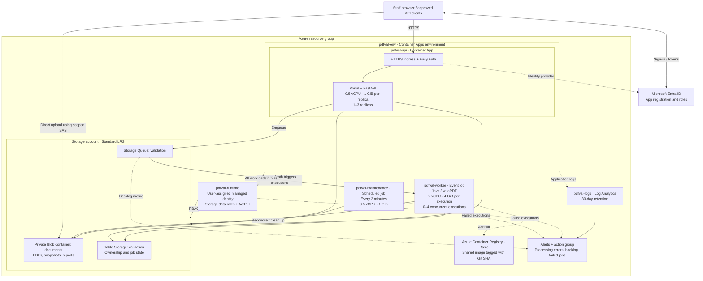

# Azure Container Apps infrastructure

Architecture defined by [`infra/foundation.bicep`](../infra/foundation.bicep) and [`infra/main.bicep`](../infra/main.bicep). This describes the repository configuration; it is not a verification of live Azure resources. Resource names use the default `pdfval` prefix.

Solid arrows show requests, data access, triggers, or log-alert evaluation. Dashed arrows show identity and monitoring relationships. All three workloads use the same release image from ACR. The queue-trigger arrow describes the platform scaler; workers also receive and acknowledge messages directly from the queue.

Microsoft Entra ID is outside the resource group. Easy Auth belongs to the API Container App and validates browser sessions and API tokens before FastAPI authorizes access. A private Blob container disables anonymous data access; this configuration does not create a private endpoint. Uploads go directly from the client to Blob Storage, while PDFs and reports are retained for 72 hours.
