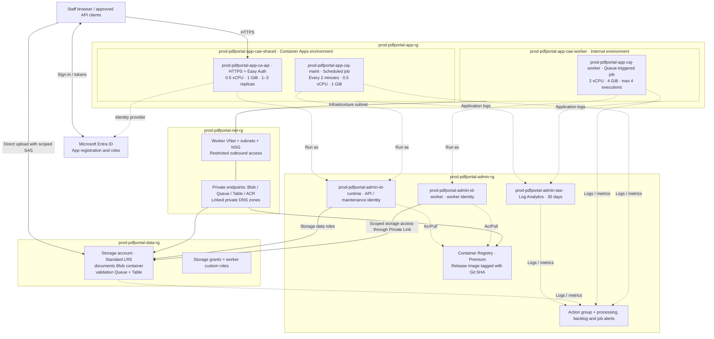

# Azure Container Apps infrastructure

Fresh deployments use four resource groups created by the subscription-scope [`infra/foundation.bicep`](../infra/foundation.bicep) and [`infra/main.bicep`](../infra/main.bicep) entry points. This describes the repository configuration; it does not verify live Azure resources. The defaults are `env=prod` and `project=pdfportal`; names use `{env}-{project}-{resource-group-type}-{resource-type}-{function-if-applicable}-{instance-num-2-digit-if-applicable}`. See the [naming inventory](azure-naming.md).

Functions distinguish each resource's purpose, including `runtime`, `worker`, `shared`, `api` and `maint`. Instance numbers are omitted because each type/function has one instance. Registry and storage names omit hyphens to meet Azure's rules; required DNS zone names, GUID resource names and application storage children follow the exceptions in the naming inventory.

| Resource group | Resources |
| --- | --- |
| `prod-pdfportal-admin-rg` | Runtime and worker managed identities, Premium Container Registry, Log Analytics, action group and alerts |
| `prod-pdfportal-net-rg` | Worker VNet, subnets, NSG, four private endpoints and linked private DNS zones |
| `prod-pdfportal-app-rg` | API and worker Container Apps environments, API Container App, worker and maintenance jobs, Easy Auth |
| `prod-pdfportal-data-rg` | Storage account, Blob container, queue, table, storage role assignments and worker custom role definitions |

Azure may also create a service-managed infrastructure resource group for the VNet-integrated Container Apps environment. Azure owns that group's lifecycle; the four groups above contain the resources declared by this repository. See [Container Apps networking](https://learn.microsoft.com/en-us/azure/container-apps/custom-virtual-networks).

Both managed environments and all workloads live in app. The worker environment references a subnet in net and the Log Analytics workspace in admin. Private endpoints in net target storage in data and ACR in admin. Runtime and worker identities live in admin; their storage assignments are defined in data, and AcrPull assignments are defined on ACR in admin. Alerts in admin use the full IDs of their app/data targets.

Microsoft Entra ID is outside these resource groups. Easy Auth belongs to the API Container App. Browser uploads use the public Blob endpoint with scoped SAS; workers access Blob, Queue, Table and ACR through Private Link. Storage anonymous access and shared keys are disabled. PDFs and reports are retained for 72 hours. All workloads use the same release image; the worker has its own identity and internal environment.

See [CI deployment](azure-ci.md), [manual provisioning](azure-manual.md) and [worker isolation](worker-isolation.md) for permissions and verification.

## Template ownership

[`infra/names.json`](../infra/names.json) supplies resource and deployment name suffixes to Bicep and [`scripts/azure_names.py`](../scripts/azure_names.py). The helper renders complete names for the workflow and manual commands.

| File | Responsibility / target group |
| --- | --- |
| [foundation.bicep](../infra/foundation.bicep) | Subscription entry point; creates all four groups and runs admin, data, network and environment modules |
| [main.bicep](../infra/main.bicep) | Subscription entry point; runs foundation, app and monitoring modules |
| [admin.bicep](../infra/admin.bicep) | Admin: runtime/worker identities, ACR, AcrPull assignments and Log Analytics |
| [data.bicep](../infra/data.bicep) | Data: storage services, application children, runtime storage grants and worker-access module |
| [worker-access.bicep](../infra/worker-access.bicep) | Data: custom worker roles and scoped assignments; references worker identity in admin |
| [worker-network.bicep](../infra/worker-network.bicep) | Net: worker VNet, NSG, subnets, private endpoints and DNS |
| [environments.bicep](../infra/environments.bicep) | App: shared and worker environments; references logs in admin and worker subnet in net |
| [app.bicep](../infra/app.bicep) | App: API, Easy Auth, worker job and maintenance job |
| [monitoring.bicep](../infra/monitoring.bicep) | Admin: action group and alerts; references logs, storage and job IDs |

The exportable architecture diagram is available as [PNG](azure-container-apps-architecture.png) and [SVG](azure-container-apps-architecture.svg).
