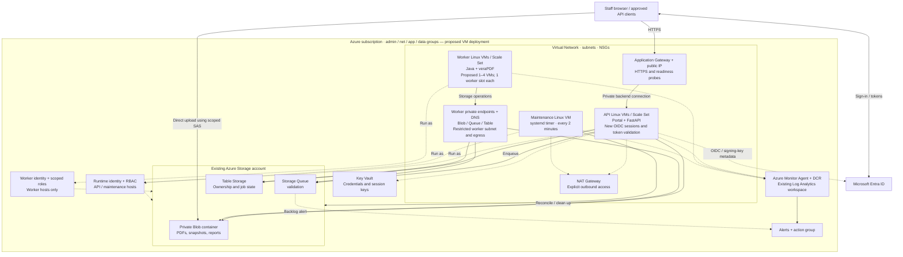

# Proposed Azure VM architecture

This is a migration design, not a deployed configuration. It is based on the resources in [`infra/main.bicep`](../infra/main.bicep) and [`infra/foundation.bicep`](../infra/foundation.bicep). The current deployment remains Azure Container Apps, with admin, net, app and data resource groups. Any future VM implementation should preserve that grouping: identities/secrets/monitoring in admin, network resources in net, VMs/scale sets/disks in app, and Storage in data. The VNet diagram below shows network membership, not resource-group ownership.

Current names and the proposed scale-set examples use [the Azure naming convention](azure-naming.md). Functions identify purpose, and single instances omit instance numbers. The [module ownership table](azure-container-apps-architecture.md#template-ownership) describes the implemented Container Apps configuration.

Assumption: move the portal, validation workers, and cleanup process to Linux Azure Virtual Machines while retaining Azure Storage, Microsoft Entra ID, managed identity, and Azure Monitor. The primary design runs native services managed by systemd; running the existing container image on VMs is an alternative.

## Equivalent resources

| Current resource or capability | VM equivalent / retained resource | Migration detail |
| --- | --- | --- |
| `prod-pdfportal-app-cae-shared` Container Apps managed environment | Virtual Network, application/worker subnets, Network Security Groups, VM network interfaces, and managed OS disks | There is no single VM resource that replaces the managed environment. Networking, host configuration, and lifecycle become explicit. |
| `prod-pdfportal-app-cae-worker` private worker environment and networking in net | Dedicated worker subnet/NSG with Storage private endpoints and linked DNS | Preserve the worker's restricted egress and Private Link access. Retain the ACR private endpoint if workers still pull container images. |
| `prod-pdfportal-app-ca-api` Container App; 1–3 replicas, each 0.5 vCPU / 1 GiB | Linux API VM, or `prod-pdfportal-app-vmss-api` Virtual Machine Scale Set | Run the built frontend and FastAPI/Uvicorn as a supervised service. A scale set supplies multiple VMs; define and tune new scaling rules. Two or more instances across supported availability zones improve API availability. |
| `prod-pdfportal-app-caj-worker` event job; 0–4 executions, each 2 vCPU / 4 GiB | Linux worker VMs, or `prod-pdfportal-app-vmss-worker` | Run queue consumers with Java and veraPDF. The diagram uses one worker slot per VM and a proposed 1–4 instance range. Keeping one VM warm changes the current scale-to-zero behavior. |
| `prod-pdfportal-app-caj-maint` scheduled job | systemd timer and one-shot service on a designated always-on VM | Run `pdf-maintenance` every two minutes. The diagram shows a dedicated small VM; it may share a fixed application VM if capacity and availability permit. Recreate the 10-minute timeout, bounded retry, and non-overlap behavior. |
| Managed external HTTPS ingress and readiness routing | Application Gateway Standard_v2, public IP, DNS record, TLS certificate, backend listener, and health probe | Route to private API VMs and probe `/health/ready`. Use WAF_v2 if a web application firewall is required. A single-VM installation can instead terminate HTTPS on a local reverse proxy. |
| Container Apps Easy Auth and its secret | Application OIDC browser sign-in/session handling and Entra access-token validation; Key Vault for secrets and session keys | Entra remains the identity provider. VM hosting does not carry over the Easy Auth sidecar. Application Gateway alone does not implement this application's authentication contract. |
| Storage account, `documents` Blob container | Retain the existing StorageV2 account and private Blob container | Keep PDFs, immutable snapshots, reports, user-delegation upload grants, and the 72-hour lifecycle in Azure Storage. VM disks hold only runtime files, temporary processing data, and logs. |
| `validation` Storage Queue | Retain Azure Queue Storage | Workers poll the same queue. VMSS autoscale can use Storage queue length, but this is not the existing Container Apps job trigger. Tune startup latency, polling, and safe scale-in. |
| `validation` Storage Table | Retain Azure Table Storage | Preserve ownership, state, ETags, outbox recovery, and tombstones. No SQL database is required by this migration. |
| `prod-pdfportal-admin-id-runtime` managed identity and data roles | Attach the runtime identity to API and maintenance VMs / scale sets | Preserve the Blob, Blob Delegator, Queue, and Table permissions. Validate `DefaultAzureCredential` and `AZURE_CLIENT_ID` on each host. |
| `prod-pdfportal-admin-id-worker` managed identity and scoped custom roles | Attach only the worker identity to worker VMs / scale sets | Preserve snapshot-only Blob reads, report-only writes through Private Link, queue consumption and existing-row Table read/update. Keep the runtime identity off worker hosts. |
| Azure Container Registry | Optional: keep ACR if running containers on VMs | For native services, deploy a versioned application release and its dependencies, optionally baked into an image distributed through Azure Compute Gallery. ACR and `AcrPull` are unnecessary for a fully native runtime. |
| `prod-pdfportal-admin-law` Log Analytics | Retain workspace; add Azure Monitor Agent and Data Collection Rules | Collect host health and application JSON logs; preserve the existing 30-day retention unless requirements change. |
| Processing, queue-backlog, and failed-job alerts; action group | Retain action group and Storage backlog alert; replace compute-specific alerts | Rewrite `ContainerAppConsoleLogs_CL` queries for the VM log table and replace Container Apps execution metrics with process exits, service health, worker/maintenance heartbeats, and host alerts. |
| Container Apps revisions / image deployment | VM image or versioned release deployment with restart/rolling rollout and rollback | Update the GitHub Actions workflow. Preserve the current GitHub OIDC deployment identity pattern with appropriate VM deployment permissions. |
| Platform-managed outbound networking, host servicing, and local storage | Explicit outbound route such as NAT Gateway; managed disks; a VM patching and recovery plan | Add Azure Update Manager if used operationally. Use Backup where persistent VM state warrants it; prefer reproducible compute and keep document data in Azure Storage. Bastion or an existing VPN can supply administrative access. |

Application Gateway supports VM and VMSS backends and health probes: [Microsoft configuration guidance](https://learn.microsoft.com/azure/application-gateway/configuration-overview). Storage queue length can drive VMSS autoscale: [Azure Monitor autoscale metrics](https://learn.microsoft.com/en-us/azure/azure-monitor/autoscale/autoscale-common-metrics). Managed identity can be attached to VMs: [Microsoft managed identity guidance](https://learn.microsoft.com/en-us/entra/identity/managed-identities-azure-resources/how-to-configure-managed-identities?pivots=qs-configure-portal-windows-vm).

## Diagram

This diagram shows the proposed native-service design. Solid arrows show requests and data access. Dashed arrows show identity, operations, or outbound dependencies. Azure Storage and Key Vault are managed services outside the VNet. Worker connections to Storage use private endpoints in the dedicated worker network; browser uploads and API/maintenance access retain the public service endpoint.

## Required application and operations changes

**Authentication is the primary migration blocker.** [`src/portal/auth.py`](../src/portal/auth.py) currently trusts an Easy Auth principal header; it does not validate a bearer token's signature or manage browser sessions. [`src/portal/config.py`](../src/portal/config.py) requires Easy Auth in production, and [`frontend/src/common.js`](../frontend/src/common.js) hard-codes the `/.auth/` login/logout routes. Replace those paths with a supported application authentication implementation, or deliberately implement a trusted authentication proxy with equivalent browser and machine-client behavior. Reject externally supplied identity headers. Keep tenant, audience, signature, expiry, role/scope, document-owner, and browser mutation protections. Preserve the existing owner-ID derivation so users retain access to their existing documents. Share session keys or session storage across API instances as required by the chosen authentication library. See [Container Apps authentication architecture](https://learn.microsoft.com/en-us/azure/container-apps/authentication) and [Entra token validation](https://learn.microsoft.com/en-us/entra/identity-platform/access-tokens).

**Preserve bounded validation capacity.** Four current worker executions allocate a combined 8 vCPU and 16 GiB to application workloads alone. These numbers are not a ready-to-use combined VM size: allow additional capacity for Linux, agents, Python, and temporary files, then benchmark representative PDFs. The existing `pdf-worker --loop` consumes one document at a time; multiple independent workers supply concurrency. Native workers need process isolation, per-worker CPU/memory limits, temporary-file isolation, execution timeouts, and supervision to replace the job boundary. Retain app-level retry/lease semantics. Drain in-flight work before scale-in or deployment; an empty visible queue does not prove that workers are idle. A timer should invoke the one-shot maintenance command because `pdf-maintenance --loop` currently uses a 30-second interval.

**Preserve browser-to-Blob reachability.** A private Blob container disables anonymous access; separate network settings determine reachability. The current Storage account supports public browser uploads and private worker connections. Keep the Blob endpoint reachable by the staff browser and update CORS for the new portal origin. If the public Storage endpoint is later disabled, staff require private network access or the upload flow must change. Provide explicit VM outbound connectivity for Entra, Azure APIs, monitoring, and updates; see [Azure outbound access guidance](https://learn.microsoft.com/en-us/azure/virtual-network/ip-services/default-outbound-access).

Preserve the current [worker isolation](worker-isolation.md) while providing that connectivity. Worker Blob grants require Private Link; keep the scoped roles, DNS and endpoints together and retain restricted worker egress. API and maintenance hosts use the runtime identity; worker hosts use only the worker identity.

**Replace platform operations.** Send application logs to a monitored local JSON file or supported logging source, configure log rotation and collection, and rewrite the existing alert queries. See [Azure Monitor JSON log collection](https://learn.microsoft.com/en-us/azure/azure-monitor/vm/data-collection-log-json). Test restarts, VM loss, rolling deployments, worker termination, stale leases, cleanup, and alert delivery. Preserve a rollback path and update Entra callbacks and DNS before cutover.

A smaller installation can put API, workers, and the maintenance timer on one VM with a local HTTPS reverse proxy. That reduces resource count but creates a single point of failure and shares CPU/RAM between interactive requests and PDF validation. It does not preserve the existing independent scaling behavior.
