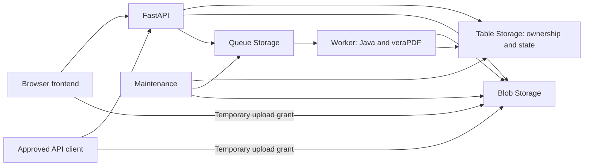

# Developer Onboarding and Knowledge Transfer

This guide helps a new developer run the PDF Validation Portal, understand its implementation, make a tested change, and take over maintenance from another engineer. It describes the repository's current behavior, not a guarantee about a live deployment.

[Back to the project overview](../README.md) · [Command reference](development.md) · [Architecture](how-it-works.md) · [Open security work](security-todo.md)

## 1. Start Here

| Stage | Read or do | Completion evidence |
|---|---|---|
| First session | Read Sections 2 to 4; start the local stack and process a sample PDF. | Local health succeeds; you can explain `passed`, `failed` and `error`. |
| First development day | Follow the source walkthrough in Sections 5 to 7; run the relevant tests in Section 8. | You can trace a request, find its tests and explain its ownership checks. |
| First contribution | Complete a small agreed change using Section 10. | Reviewed diff, relevant test results and documented limitations. |
| Knowledge transfer | Work through Section 12 with the outgoing developer or mentor. | Recorded walkthroughs, teach-back, known gaps and named follow-up owners. |

These are suggested milestones, not a required schedule. Do not begin with a production deployment or a rewrite of authentication, storage or worker coordination.

| Information needed | Status |
|---|---|
| Developer mentor and code-review owner | **TBD: Confirm with application owner** |
| Product owner and accessibility subject-matter expert | **TBD: Confirm with application owner** |
| Issue tracker, priorities and acceptance process | **TBD: Confirm with application owner** |
| Repository access, branch protections and merge permissions | **TBD: Confirm with application owner** |
| Approved test environment, identities and test data | **TBD: Confirm with application owner** |
| Release approver, DevOps and security contacts | **TBD: Confirm with application owner** |

Repository access and a local Docker installation are sufficient to begin the local lab. Production Azure access is not a prerequisite. Obtain any later access through the team's normal process, using your own identity.

## 2. Product and System Overview

Staff upload PDFs, select validation profiles, and inspect reports describing failed accessibility checks. The application does not remediate documents. Automated success does not establish full accessibility or WCAG conformance; manual review remains necessary.

The supported profiles are PDF/UA-1 and a vendored custom WCAG 2.2 profile. The API defaults to WCAG when `profiles` is omitted. Tests or integrations that need both must request both explicitly.

| Result | Meaning | Developer implication |
|---|---|---|
| `passed` | Requested validation completed with no failing checks reported. | Keep the manual-review disclaimer. |
| `failed` | Validation completed and found nonconformance. | This is a valid result, not an HTTP or infrastructure failure. |
| `error` | At least part of processing could not complete. | Preserve per-profile details; another profile may have succeeded. |



In Azure, Container Apps Easy Auth validates sign-in or tokens before protected requests reach FastAPI. The application then checks roles/scopes and document ownership. Locally, Compose uses an explicit development identity and Azurite, an Azure Storage emulator. The local configuration must never be used for a shared or production deployment.

### Technology map

| Area | Implementation |
|---|---|
| Backend | Python 3.12 in the image; FastAPI, Pydantic settings/models and Azure Storage SDKs. |
| Frontend | JavaScript ES modules, Vite and CSS. No React component tree. |
| Validation | Java 21 and checksum-verified veraPDF 1.30.2; a separate process handles each profile. |
| Browser PDF previews | `pdfjs-dist` for rendering, with `@cantoo/pdf-lib` loaded for structural lookup when needed. |
| Data | Blob for PDFs/reports, Table for metadata and Queue for work dispatch. No SQL database is defined. |
| Infrastructure | Bicep, Azure Container Apps, Container Apps jobs, managed identity, registry and Log Analytics. |
| Automation | GitHub **Verify** for CI; manually triggered **Deploy Azure** for releases. |
| Integrations | Versioned HTTP API, PHP SDK and Python example client. |

Exact versions and dependencies are in [Dockerfile](../Dockerfile), [requirements.lock](../requirements.lock), [frontend/package-lock.json](../frontend/package-lock.json) and [sdk/php/composer.json](../sdk/php/composer.json). Read them before changing dependencies; do not replace pinned versions simply because a newer version exists.

## 3. First Local Run

### Prerequisites

- Git and repository access.
- Docker Engine with Compose and enough available disk/memory to build and run the stack.
- Node 22 and npm for frontend development and browser tests.
- Python 3.12 and Java 21 only if running backend tools or emulator integration on the host. The container already includes its runtime and engine.
- PHP and Composer only for PHP SDK work; use a PHP version supported by its Composer dependencies.

Use approved non-sensitive fixtures. Local browser tests and integration tests create and delete data. Never point them at production, a shared user's workspace or real customer documents.

### Start the container stack

Run from the repository root in your local checkout:

```sh
docker compose up --build -d
docker compose ps
curl --silent --show-error --fail --max-time 20 http://127.0.0.1:8000/health/ready
```

The first build downloads dependencies and the verified engine installer. If startup is still in progress, inspect `docker compose logs --tail 100 api storage-init` and retry the health request after startup completes. Expected readiness output is `{"status":"ready"}`.

| Local service | Purpose |
|---|---|
| `azurite` | Emulates Blob, Queue and Table Storage; local data is kept in a Docker volume. |
| `storage-init` | Creates the emulator's container, queue and table, then exits. A successful exit is expected. |
| `api` | Serves the built frontend and API on port 8000. |
| `worker` | Runs `pdf-worker --loop` and processes queued documents. |
| `maintenance` | Runs `pdf-maintenance --loop` for dispatch recovery and cleanup. |

Open [the local portal](http://127.0.0.1:8000) and [local API documentation](http://127.0.0.1:8000/docs). These are local endpoints, not Azure deployment addresses.

### Verify the complete local flow

1. Upload [ua-pass.pdf](../tests/fixtures/ua-pass.pdf), explicitly selecting WCAG and PDF/UA-1.
2. Observe `queued`, `running`, then the completed profile results. A small fixture should complete well before the configured profile timeout, but do not treat timing as a production performance target.
3. View the submitted PDF and download the JSON and available XML reports.
4. Upload [ua-fail.pdf](../tests/fixtures/ua-fail.pdf). The real-engine tests expect PDF/UA-1 to fail while WCAG passes.
5. Upload [encrypted.pdf](../tests/fixtures/encrypted.pdf) and inspect the processing error. Explain why this differs from a validation-rule failure.
6. Inspect the local output: `docker compose logs --tail 100 api worker maintenance`.
7. Delete only your disposable local test documents and confirm they disappear from the API/UI.

Stop with `docker compose down`. The `-v` option also erases local emulator volumes; use it only when you intend to discard that local data. Do not copy cleanup commands from CI without understanding their effect.

## 4. Choose a Development Loop

### Frontend editing with the container backend

Keep the Compose API running on port 8000. From the repository root:

```sh
npm ci --prefix frontend
npm run dev --prefix frontend
```

Open [Vite on port 5173](http://127.0.0.1:5173). [vite.config.js](../frontend/vite.config.js) proxies `/api` and `/health` to port 8000. The built UI on port 8000 does not automatically reflect source edits served by Vite.

Compose does not mount the application source into the image. To exercise a backend change or the updated built UI in containers, rebuild the affected application services:

```sh
docker compose up --build -d api worker maintenance
```

Use a normal page reload after rebuilding. If behavior appears stale, confirm which origin and source/build mode you are viewing before editing code again.

### Optional host Python development

This path is useful for backend breakpoints and fast reload. First build the Compose stack so its verified engine is available, and ensure host Java 21 is installed. Keep Azurite running, then prepare the host environment:

```sh
python3.12 -m venv .venv
. .venv/bin/activate
python -m pip install -r requirements.lock
python -m pip install --no-deps -e .
if [ ! -e .env ]; then cp .env.example .env; fi
mkdir -p .venv/engine
docker compose cp api:/opt/verapdf/bin/cli-1.30.2.jar .venv/engine/cli.jar
export PDF_VERAPDF_JAR="$PWD/.venv/engine/cli.jar"
java -version
```

Review an existing `.env` instead of overwriting it. Confirm it points only to the local emulator, with `PDF_ENVIRONMENT=local` and `PDF_DEV_IDENTITY=true`. Environment variables exported by your shell can override `.env`; check relevant `PDF_*` settings without printing secrets. Keep `.env` and generated credentials out of Git.

For host processes, the copied engine path must be set in each terminal or in your local ignored `.env`. The template contains a placeholder engine path. The host uses loopback Storage endpoints; a Compose container uses the `azurite` service hostname. These are not interchangeable.

Stop the container application processes before replacing them with host processes, so port ownership and worker behavior remain clear:

```sh
docker compose stop api worker maintenance
python scripts/init_storage.py
npm run build --prefix frontend
uvicorn portal.app:create_app --factory --host 127.0.0.1 --port 8000 --reload --no-access-log
```

In two additional terminals, activate `.venv`, set the same local engine/configuration, and run `pdf-worker --loop` and `pdf-maintenance --loop`. Vite can still serve frontend source on 5173. Stop these host processes before restarting the Compose application services.

For further command details, use [development.md](development.md). Do not bind the development identity to a public interface.

## 5. Source Map and Reading Order

Read one user flow end to end before studying every module.

| Area | Start here | Responsibility |
|---|---|---|
| API composition | [app.py](../src/portal/app.py) | `create_app`, routes, dependencies, headers, exception mapping, health and static files. |
| Contracts | [models/api.py](../src/portal/models/api.py), [models/report.py](../src/portal/models/report.py) | Validated requests and public response/report shapes. |
| Authentication/ownership | [auth.py](../src/portal/auth.py) | Validated principal interpretation, roles/scopes, owner namespace and cookie-write protection. |
| Configuration | [config.py](../src/portal/config.py) | Statuses, profiles, limits, settings and production configuration checks. |
| Document state | [domain.py](../src/portal/domain.py) | Reserve, submit, dispatch, ownership, state transitions, deletion and public projections. |
| Azure adapter | [storage.py](../src/portal/storage.py) | Blob/Table/Queue access, conditional writes, upload grants, snapshots and streaming. |
| Processing | [worker.py](../src/portal/worker.py), [services/runner.py](../src/portal/services/runner.py) | Claim work, run profiles, publish reports and handle retries/process limits. |
| Report interpretation | [services/report_parser.py](../src/portal/services/report_parser.py), [services/grouping.py](../src/portal/services/grouping.py) | Parse veraPDF XML and group related failures without losing occurrence information. |
| Efficient reads | [services/documents.py](../src/portal/services/documents.py), [services/reports.py](../src/portal/services/reports.py) | Metadata-only activity, document cursors and chunked report pages. |
| Recovery/cleanup | [maintenance.py](../src/portal/maintenance.py), [cli.py](../src/portal/cli.py) | Lease recovery, queue dispatch reconciliation, expiration and one-shot versus loop execution. |
| Logging/request limits | [events.py](../src/portal/events.py), [middleware.py](../src/portal/middleware.py) | Structured event output and request-body protection. |
| UI startup and session | [entry.js](../frontend/src/entry.js), [app.js](../frontend/src/app.js), [api.js](../frontend/src/api.js), [common.js](../frontend/src/common.js) | Styles/theme, session gate, API helper and shared interactions. |
| Upload coordination | [upload.js](../frontend/src/upload.js) | Staging, per-file retries, profile selection and upload/submission. |
| Workspace/detail coordination | [results.js](../frontend/src/results.js), [detail.js](../frontend/src/detail.js) | Polling, pagination, expanded reports, stale-request cancellation and deletion UI. |
| PDF previews | [previews-ui.js](../frontend/src/previews-ui.js), [pdf-previews.js](../frontend/src/pdf-previews.js), [pdf-document.js](../frontend/src/pdf-document.js), [pdf-sessions.js](../frontend/src/pdf-sessions.js) | Preview dialog, rendering, shared PDF sessions and resource cleanup. |
| PDF locations | [pdf-locations.js](../frontend/src/pdf-locations.js), [pdf-geometry.js](../frontend/src/pdf-geometry.js), [pdf-structure.js](../frontend/src/pdf-structure.js) | Interpret report locations and find/render useful regions. |
| UI presentation | [ui.js](../frontend/src/ui.js), [style.css](../frontend/src/style.css), [login.css](../frontend/src/login.css), [theme.js](../frontend/src/theme.js) | Labels, DOM helpers, layout, sign-in styling and theme. |
| Deployment/runtime | [compose.yaml](../compose.yaml), [Dockerfile](../Dockerfile), [infra/main.bicep](../infra/main.bicep), [infra/foundation.bicep](../infra/foundation.bicep) | Local services, shared image and Azure resources. |

### Trace one reservation through completion

1. Start at `submitItem` in `frontend/src/upload.js`. A staged item retains its idempotency key, profiles and reservation for retries.
2. Follow `api` in `frontend/src/api.js` to `POST /api/v1/documents` in `src/portal/app.py`.
3. Follow `reserve` in `domain.py`: ownership and key determine the document ID; the metadata fingerprint detects incompatible key reuse.
4. Follow `upload_url` in `storage.py`. The browser sends the PDF to Blob Storage, not through FastAPI, and must not send the Entra token to the upload host.
5. Follow the submit route to `submit`. It verifies the actual blob, pins a snapshot, saves queued state and attempts queue dispatch.
6. Follow `once`, `process_document`, `claim` and `publish` in `worker.py`. Identify the attempt, run ID, lease and conditional write that permits publishing.
7. Follow the result back through status/activity, detail, issues and report endpoints into the UI. Inspect the corresponding lifecycle and browser tests.
8. Finish at `sweep` in `maintenance.py`. Explain how unfinished dispatch, an expired worker lease and deletion are handled.

During knowledge transfer, demonstrate this with a local fixture and file/function names rather than only an architecture diagram.

## 6. Rules That Changes Must Preserve

These are current design constraints. A deliberate change needs an explicit contract/security review and regression coverage.

| Rule | Why it matters | Relevant evidence |
|---|---|---|
| Every document lookup is scoped to the authenticated owner. | Missing, expired, deleted and another owner's document must not reveal private data. | `get_owned`; ownership tests in [test_lifecycle.py](../tests/test_lifecycle.py). |
| Production principal headers are trusted only behind enabled Easy Auth. | The application does not independently establish the authenticity of a caller-supplied principal header. | [auth.py](../src/portal/auth.py), [test_easyauth.py](../tests/test_easyauth.py), security backlog M3. |
| Cookie writes preserve same-origin checks. | Sign-in alone does not protect a state-changing browser request from cross-site abuse. | `identity`; cookie CSRF tests. |
| Retry identity is stable. | A lost response must not cause an unintentional second reservation. Same key plus changed metadata is a conflict. | `reserve`, `submitItem`, lost-response browser tests. |
| Validation reads the submitted snapshot. | A still-valid upload grant must not change what a worker validates. | `snapshot`, `input_blob`, emulator integration tests. |
| State changes use conditional writes. | ETags prevent a stale worker from overwriting deletion, a new claim or a newer result. | `Storage.save`, `save_transition`, `publish`, deletion-race tests. |
| Queue delivery is not assumed to be exactly once. | Duplicate messages and interrupted sends must be safe. | Saved queued state, `dispatch_document`, lease/attempt logic. |
| Deleted records remain long enough to prevent late work from reviving data. | Upload grants and in-flight workers can outlive the first delete request. | `tombstone`, `purge_after`, maintenance cleanup tests. |
| Status polling stays cheap. | Re-reading full reports or all workspace data on every poll wastes Storage requests and browser work. | Activity projection and [test_read_efficiency.py](../tests/test_read_efficiency.py). |
| Reports preserve profile and occurrence information. | UI grouping must not hide the full evidence available in exported JSON/XML. | Report/parser/grouping models and presentation tests. |
| Async UI work cannot overwrite newer state. | Search, pagination, report closure and reconnect can leave old requests completing later. | Abort handling and coordination/preview tests. |

### Limits and failure semantics

Current defaults include 200 MiB per file, 200 files / 2 GiB per browser selection, five minutes per profile, three infrastructure processing attempts, a 900-second worker lease and 72-hour submitted-data retention. Upload reservations expire after one hour. See [config.py](../src/portal/config.py) and [the Tier 2 architecture section](runbook-tier-2.md#2-architecture-and-failure-boundaries).

The Java heap, container memory, output limit, profile timeout, job timeout and lease work together. Increasing just one can create new failures. Deterministic profile errors do not behave like transient infrastructure retries. An Azure job can exit successfully while the document result is `error`, or while a handled failure awaits another attempt.

API behavior to recognize:

- `401`/`403`: missing authentication or insufficient permission/same-origin checks.
- `404`: missing, unavailable or not-owned data; do not make these distinguishable casually.
- `409`: state conflict, incomplete upload, retry conflict or report not yet available.
- `413`/`422`: request/input limits or validation problems.
- `500`/`503`: application failure or dependency unavailability.

A 503 during submission can occur after queued state was saved. Inspect/poll that document and follow [API retry rules](api.md) before creating a new one.

### Frontend performance and accessibility

PDF previews are best-effort location aids; not every validation issue has a precise page rectangle. Keep a usable fallback and do not manufacture a location. Preserve lazy loading of heavy PDF libraries, bounded document sessions/caches and cancellation when consumers close or change a view.

Keep keyboard interaction, focus restoration, accessible names, reduced-motion behavior, mobile layout and the sign-in gate covered when changing UI. User-supplied names and report text should be rendered as text, not inserted as HTML. Automated accessibility tests are a baseline, not a substitute for manual review.

## 7. Security Knowledge and Open Work

Read [security-todo.md](security-todo.md) before changes to authentication, upload grants, parser execution, networking, dependencies or document lifetime. It is a dated review and an open backlog, not a list of completed controls or a live penetration-test result. Confirm item status and scope with the security owner.

Important open themes include shared worker privileges, delegated access policy, quotas/rate limits, dependence on platform authentication configuration, browser hardening, non-production mode protection and supply-chain controls. Link the relevant finding ID in related work rather than duplicating a separate backlog here.

Current behavior accepts a delegated `Validation.Access` scope without also requiring `Validation.User`; backlog item M1 proposes a stricter policy. Do not document the proposed rule as already implemented. Authentication changes must consider both browser users and existing integrations.

Never commit or log tokens, cookies, passwords, client secrets, connection strings, temporary upload URLs or customer PDFs. The application's structured logs intentionally omit filenames, paths, query strings and raw exception messages. Preserve that discipline when adding diagnostics. Use synthetic fixtures and narrowly scoped metadata in bug reports.

The direct upload path uses temporary credentials and bypasses the API's body handling. A submit-time file-size check is not the same as a storage-side upload quota. Keep that distinction when reviewing resource-use changes.

## 8. Testing: Choose the Right Layer

The source of truth for CI is [.github/workflows/ci.yml](../.github/workflows/ci.yml). Do not rely on historical pass counts in documentation. Record the commit, command, outcome and skipped tests for your own change.

| Change or risk | Tests to start with | What they establish |
|---|---|---|
| Ownership, idempotency, transitions, retries or cleanup | [test_lifecycle.py](../tests/test_lifecycle.py) | State and race behavior with the in-memory adapter. |
| Authorization, trusted claims, cookie writes | [test_easyauth.py](../tests/test_easyauth.py), [test_auth_runner.py](../tests/test_auth_runner.py) | Application checks, not Azure's token validation or header sanitization. |
| Storage snapshots, grants, conditional writes | [test_storage.py](../tests/test_storage.py), [test_azure_integration.py](../tests/test_azure_integration.py) | Adapter behavior and actual emulator interactions. |
| XML parsing, process limits and engine output | [test_auth_runner.py](../tests/test_auth_runner.py), [test_presentation.py](../tests/test_presentation.py) | Parsing, bounds, profile outcomes and report interpretation. |
| Read cost, cursors and report streaming | [test_read_efficiency.py](../tests/test_read_efficiency.py) | Projection, page reads, stable pagination and streamed exports. |
| Static asset caching | [test_static.py](../tests/test_static.py) | Hashed-asset caching without caching private API responses. |
| Upload and workspace UX | [portal.spec.js](../frontend/tests/portal.spec.js) | Real local flows, retries, session UI, keyboard and accessibility checks. |
| Polling or stale-request races | [coordination.spec.js](../frontend/tests/coordination.spec.js) | Scheduling, cancellation, pagination and report refresh coordination. |
| PDF previews and resource lifetime | [previews.spec.js](../frontend/tests/previews.spec.js), [pdf-sessions.unit.js](../frontend/tests/pdf-sessions.unit.js) | Lazy loading, cache/session bounds, disposal and cancellation. |
| PHP SDK | [ClientTest.php](../sdk/php/tests/ClientTest.php) | Client contracts and transport behavior. The main Verify workflow does not run this suite. |

The [MemoryStorage fixture](../tests/conftest.py) intentionally ignores OData prefilters, and projected reads do not carry ETags. Unit success does not establish that a real Table query has correct syntax or filtering; use emulator integration when changing it.

### Container Python tests

From the repository root after building the image:

```sh
docker compose run --rm -v "$PWD/tests:/app/tests:ro" api \
  python -m pytest -q -p no:cacheprovider -m 'not integration'
```

This uses the built source and engine inside the image. Rebuild after Python source changes. Mounting `tests` alone does not update the installed application code.

### Host checks and emulator integration

After the optional host environment in Section 4 is prepared:

```sh
ruff check src tests scripts
ruff format --check src tests scripts
python -m pytest -q -m 'not integration'
RUN_AZURE_INTEGRATION=1 python -m pytest -q -m integration
```

Keep Azurite running and verify the host configuration points to it before integration tests. These tests create temporary storage resources and delete them afterward. Never use production credentials or endpoints. They require the real engine and host Java; tests marked `verapdf` can skip when the engine is unavailable. Inspect skipped output rather than reporting a partial run as full coverage.

### Frontend checks

Keep the local API available on port 8000. From the repository root:

```sh
npm ci --prefix frontend
npm run format:check --prefix frontend
npm run build --prefix frontend
npm run test:unit --prefix frontend
(
  cd frontend
  npx playwright install chromium
  PORTAL_URL=http://127.0.0.1:8000 npm test
)
```

`npm test` includes unit tests and Playwright. [playwright.config.js](../frontend/playwright.config.js) uses full Chromium for PDF viewer behavior and one worker. Tests tagged `@source` use Vite on port 5173; other browser tests target the built app on port 8000. Playwright starts/reuses Vite but does not start the API. If a server already occupies 5173, confirm it belongs to this checkout before letting tests reuse it.

The explicit local `PORTAL_URL` prevents an inherited setting from sending destructive test actions to a remote portal. Rebuild the Compose image when browser tests need updated backend or built frontend code. Review failure screenshots for sensitive information before sharing them.

### Infrastructure and PHP changes

For Bicep changes, use the same compilation check as CI with the approved Azure CLI/Bicep toolchain:

```sh
az bicep build --file infra/main.bicep --outfile /tmp/pdf-portal-onboarding-main.json
```

This compiles a local file; it does not deploy. Compilation cannot prove permissions, quotas or cloud behavior.

For SDK work, from the repository root:

```sh
(
  cd sdk/php
  composer install
  composer lint
  composer test
)
```

Use the SDK's declared PHP/dependency requirements. Do not imply SDK tests ran as part of the main CI workflow. Review generated dependency-file changes before committing.

### What local testing cannot prove

Azurite and local principal fixtures do not validate live Entra token signatures, audience/tenant enforcement at Azure's edge, principal-header sanitization, cloud managed-identity propagation, event scaling, alert delivery or full-load production capacity. Coordinate those checks with DevOps using [the Tier 2 release verification procedure](runbook-tier-2.md#10-verify-recovery-or-a-release).

## 9. Debugging and Common Setup Problems

Start with the failing boundary: browser, API, direct Blob upload, worker, maintenance or report read. Capture the document/request ID and expected versus actual behavior using local fixtures.

| Symptom | Check | Next step |
|---|---|---|
| Port 8000 already used | Compose API and host uvicorn may both be running. | Choose one backend mode and stop the other. |
| Frontend changes are missing | Browser origin and built versus source mode. | Use Vite on 5173 or rebuild the container for 8000. |
| Backend tests ignore an edit | Container contains the previous source build. | Rebuild before testing; the test mount does not replace `src`. |
| “Frontend has not been built” | `frontend/dist` is absent in host mode. | Run `npm ci --prefix frontend` and `npm run build --prefix frontend`. |
| Local readiness fails | Azurite status, initialization and host/container endpoint choice. | Inspect `api`, `azurite` and `storage-init` logs; confirm local settings. |
| Profile tests skip | `PDF_VERAPDF_JAR` path and Java availability. | Configure the verified engine; rerun and report skipped tests accurately. |
| Documents remain queued | Worker process and queue access. | Inspect worker output; avoid manually changing state. |
| Request/session failure | Local identity settings or API response in browser Network tools. | Confirm local configuration; do not spoof production principal headers. |
| API succeeds but Blob PUT fails | Upload host, grant expiry and endpoint/CORS configuration. | Inspect sanitized network metadata, never share the query string. |
| Browser test cannot connect | API on 8000 and Vite on 5173. | Start the correct backend; confirm existing Vite belongs to this checkout. |
| Old search/detail/preview content appears | Request cancellation and generation checks. | Reproduce with coordination/preview tests before changing polling. |

Request logs include `request_id`, status and duration; responses expose `X-Request-ID` where the application handles them. Worker events include document IDs and attempt/outcome information. There is no guaranteed single trace ID spanning the API, queue and Java process. Use timestamps plus the document ID to connect the stages.

For Azure incidents, hand over to [Tier 1](runbook-tier-1.md) or [Tier 2](runbook-tier-2.md) as appropriate. Developer onboarding does not grant authority to restart, alter roles, replay jobs, edit data or deploy production.

## 10. Make and Deliver a Change

1. Agree on the issue, expected behavior, acceptance examples and reviewer. Identify whether API clients, stored records or in-flight jobs are affected.
2. Read the relevant code and existing tests. Reproduce a defect before fixing it when feasible. For a behavior change, define an example of the intended result.
3. Keep the change focused. Preserve ownership, retry and async cancellation rules unless the change explicitly redesigns them with the responsible reviewers.
4. Run tests that exercise the changed behavior, then the required CI checks. Do not add tests that merely repeat implementation details.
5. Review security implications against [security-todo.md](security-todo.md). Update its item status only with agreement and evidence; this guide does not close any item.
6. Update public API/SDK docs and operational guidance when contracts, defaults, errors or recovery behavior change. Consider old reports and existing metadata, not just newly created fixtures.
7. Open the PR with the concrete problem, resulting behavior, validation and any deployment/compatibility limits. Include visual evidence for meaningful UI changes and the outcomes of manual keyboard/accessibility checks.
8. Confirm the exact commit's **Verify** result. Merge and release permissions follow the team's policy: **TBD: Confirm with application owner**.

### Release handoff

Production runs on Azure Container Apps. The [Deploy Azure workflow](../.github/workflows/deploy.yml) builds one image and updates the API plus worker and maintenance jobs. It also reapplies infrastructure and authentication settings. There is no declared workflow dependency requiring **Verify** to pass before deployment; the release owner must check the approved commit explicitly.

Provide DevOps the source commit, compatibility assessment, expected user-visible change, smoke tests and rollback constraints. The deployment's readiness check does not prove login, uploads or validation work. Use [azure-ci.md](azure-ci.md) and [the Tier 2 release procedure](runbook-tier-2.md#8-releases-failed-deployments-and-rollback) for approved deployments.

Changing a report schema, lifecycle field or queue message can affect old records and workers already running. There is no generic database migration framework to handle that automatically. Review compatibility and recovery with the owner before release.

## 11. Suggested First Contribution and Practice

Choose one bounded task with the mentor, such as a documented setup correction, a UI error-message improvement, or a small regression fix with an existing test location. Avoid choosing an unresolved security redesign as an unsupervised first task.

For a local practice session:

1. Trace one successful fixture through reservation, upload, submission, processing and report display.
2. In the local lab only, run `docker compose stop worker`, submit a disposable fixture, and explain why readiness can still pass while processing waits. Run `docker compose start worker` and observe recovery.
3. Read the lost-response upload test and explain how a stable key avoids duplicate creation.
4. Read the worker deletion-race test and explain why publishing cannot restore a deleted document.
5. Close and reopen a report while a local preview is loading. Explain the cancellation/session cleanup path and its tests.
6. Make the agreed small change, run its checks, and have the mentor review both the implementation and the explanation.

Completion means the developer can reproduce and explain the behavior, not just run commands successfully.

## 12. Knowledge Transfer Checklist and Handover Record

### Sessions to complete together

| Session | Outgoing developer demonstrates | Incoming developer teaches back |
|---|---|---|
| Product and accessibility | A representative pass, rule failure, processing error and partial-profile result. | What the product establishes and what still needs human review. |
| Request and ownership flow | API dependency, principal, owner partition and protected document lookup. | Why another identity cannot read a document and which checks depend on Azure. |
| Upload and state changes | Stable retry key, direct upload, snapshot, queued state and dispatch. | What can be durable after a failed HTTP response. |
| Worker and cleanup | Claims, lease, attempts, conditional publish, tombstones and maintenance. | What happens after a crash, duplicate delivery or deletion race. |
| Frontend coordination | Session gate, polling, cursors, detail requests and preview disposal. | How stale work is cancelled and heavy reads/renders are avoided. |
| Test strategy | Unit adapter, real engine, emulator, built-app browser and source tests. | Which layer covers a proposed change and what local tests cannot prove. |
| Security and operations | Open finding IDs, trusted boundaries, sanitized diagnostics and release handoff. | Who approves changes and when to stop and escalate. |

### Capture decisions that are not in the code

- [ ] Current product priorities, unsupported use cases and accepted accessibility limitations.
- [ ] Why the current validation profiles and versions were selected, with decision links where available.
- [ ] Consumers of the API/PHP SDK and any compatibility commitments.
- [ ] Known high-cost operations, representative workloads and untested capacity assumptions.
- [ ] Current security finding owners, priorities, mitigations and unresolved decisions.
- [ ] Test fixtures and their provenance; handling rules for any non-public examples.
- [ ] Release ownership, review requirements, environment details and operational follow-up.
- [ ] Recent incidents or difficult bugs, their evidence, and lessons not yet reflected in documentation.
- [ ] Dependency update process and the method used to regenerate each lockfile.

If a decision is unknown, write **TBD: Confirm with application owner** and assign a follow-up owner. Do not turn an undocumented assumption into a project rule.

### Copy-and-paste handover record

```text
Developer onboarding / knowledge transfer
Incoming developer:
Outgoing developer or mentor:
Date and source commit reviewed:
Issue / handover tracking link:

Access confirmed (no credentials):
Local setup mode and tool versions:
Sample flow demonstrated and outcome:
Code walkthroughs completed:
Tests run, results and skips:
Small contribution / PR reviewed:

Ownership / authentication explanation completed:
Retry / snapshot / lease / deletion explanation completed:
Frontend cancellation / preview cleanup explanation completed:
Security findings reviewed and their owners:
API consumers and compatibility constraints:
Release and incident handoff contacts:

Known limitations or undocumented decisions:
Outstanding item | owner | due date:
Evidence links / approved recording location:
Mentor sign-off and remaining supervision needs:
Next review date:
```

Do not record tokens, customer PDFs or sensitive screen content in handover recordings. Follow the team's approved recording/storage process.

### Ready to maintain the application

- [ ] Can start and diagnose the local stack without production credentials.
- [ ] Can trace a document and identify the relevant source and tests.
- [ ] Can explain the ownership, retry, snapshot, lease and deletion guarantees.
- [ ] Can run the right checks and distinguish real coverage from skipped or mocked behavior.
- [ ] Can make a reviewed change without breaking browser/API compatibility or resource cleanup.
- [ ] Knows the open security backlog, operational contacts and production change boundaries.
- [ ] Has a recorded mentor review and an owner for remaining gaps.

## 13. Continuing References

| Need | Document |
|---|---|
| Daily setup and commands | [Development and testing](development.md) |
| Architecture and resource model | [How it works](how-it-works.md) |
| Endpoint and retry contracts | [API guide](api.md) |
| External integration authentication | [Azure API setup](azure-api.md), [PHP SDK](../sdk/php/README.md), [Python example](../scripts/validate.py) |
| Open security findings | [Security TODO](security-todo.md) |
| User workflows | [User guide](user-guide.md) |
| Incident diagnosis and release operations | [Tier 1 runbook](runbook-tier-1.md), [Tier 2 runbook](runbook-tier-2.md) |
| Azure deployment | [Deployment workflow guide](azure-ci.md), [Manual setup guide](azure-manual.md) |
