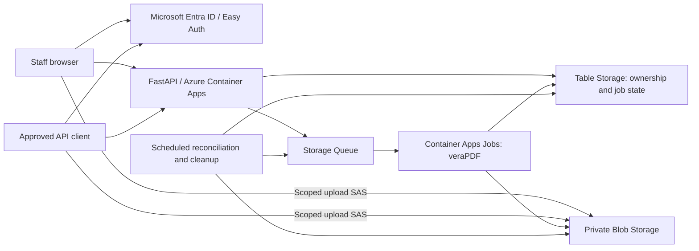
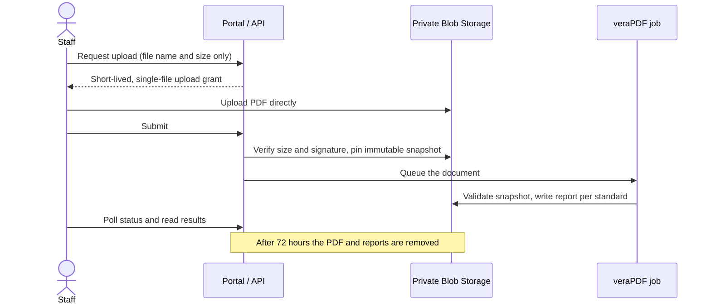
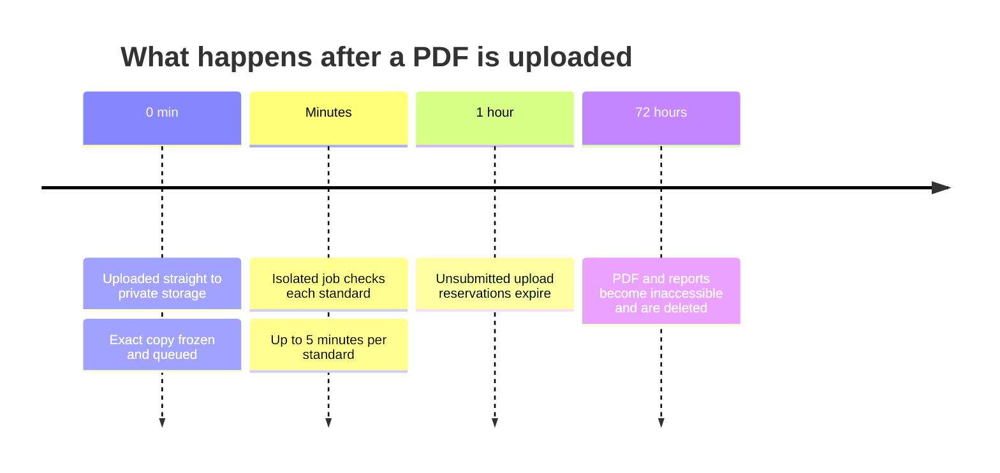
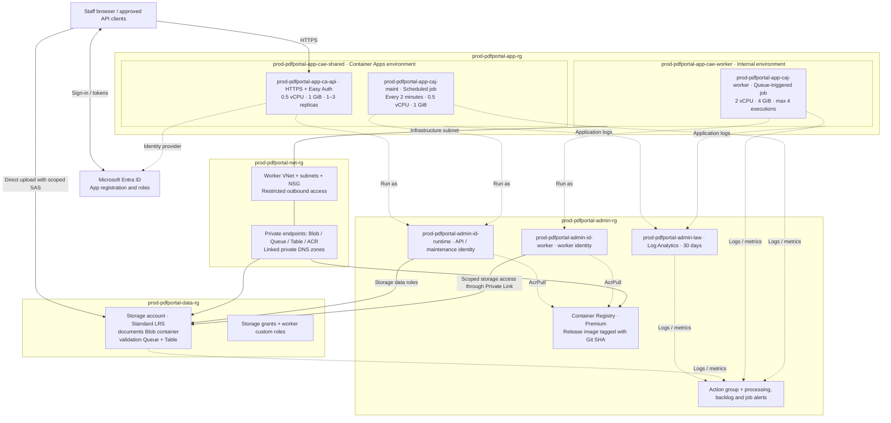

# How it works

[← Back to overview](../README.md)

FastAPI serves the portal and API on Azure Container Apps. Isolated Java/veraPDF jobs validate each uploaded PDF against PDF/UA-1 and the vendored custom WCAG 2.2 profile ([`profiles/WCAG-2-2-Complete.xml`](../profiles/WCAG-2-2-Complete.xml)).

## A document's journey

## Security

- Azure Entra Easy Auth handles browser sessions and integration token validation. Visitors without an authorized session see a sign-in card over the blurred, inert workspace shell, which holds no document data; the card appears whenever `/api/session` rejects them. The portal uses server-directed sign-in and the same versioned API as integrations.
- Upload requests carry metadata only; PDFs go directly to Blob Storage with short-lived, per-blob write grants. An owner-protected endpoint streams the submitted snapshot for viewing in a new tab.
- Submission checks the actual size and signature and pins an immutable snapshot before queueing. Original filenames are display metadata, never blob paths or shell arguments.
- Every document is scoped to its tenant and owner. Production rejects the local development identity.
- CSP and `X-Frame-Options: DENY` prevent framing of the portal. Scripts and PDF workers load from the portal origin; direct uploads are allowed only to the configured Blob endpoint. Production uses HSTS, and PDF previews explicitly disable JavaScript evaluation.

## Reliability

- ETag claims and attempt-specific report paths prevent duplicate messages, stale workers and deletion races from publishing the wrong result. Queue delivery is at least once, not exactly once.
- Each queued document is its own durable outbox. Maintenance retries undispatched work and recovers expired worker leases.
- A document gets at most three processing attempts for infrastructure failures; deterministic validation failures are not retried.
- Every file produces separate profile results. A processing error is distinct from a nonconforming PDF, and a successful profile report survives another profile's failure.

## Data lifecycle

- Upload reservations expire after one hour. Submitted files and reports become inaccessible after 72 hours, and users can delete them sooner.
- Cleanup runs every two minutes in Azure (every 30 seconds locally). Deletion tombstones persist beyond outstanding upload grants and worker leases to catch late writes.

## Performance and capacity

- Fast portal polls read only active metadata. Document lists use stable cursors, and new report pages read only their intersecting stored chunks. Full JSON/XML downloads stream from storage. Exact workspace totals and filename filtering still require scanning the owner's live metadata.
- One worker processes one PDF and runs profiles sequentially. Azure starts with at most four executions, each 2 vCPU/4 GiB, a 2 GiB JVM heap, five minutes per profile, and a 20 MiB combined stdout/stderr limit per profile.
- The API creates one document per request; the portal coordinates multi-file selections.

## Azure resources

The **Deploy Azure** workflow creates four resource groups through subscription-scope [`infra/foundation.bicep`](../infra/foundation.bicep) and [`infra/main.bicep`](../infra/main.bicep). Names follow `{env}-{project}-{resource-group-type}-{resource-type}-{function-if-applicable}-{instance-num-2-digit-if-applicable}` with `env=prod` and `project=pdfportal` by default. Functions distinguish purposes such as `api`, `worker` and `maint`; the current single instances omit instance numbers. Registry/storage names omit hyphens; there is no hash suffix. See [Azure naming](azure-naming.md) and [template ownership](azure-container-apps-architecture.md#template-ownership). The templates assume a fresh deployment.

| Resource group | Resources |
| --- | --- |
| `prod-pdfportal-admin-rg` | Runtime and worker managed identities, Premium Container Registry, Log Analytics, action group and alerts |
| `prod-pdfportal-net-rg` | Worker VNet, subnets, NSG, four private endpoints and linked private DNS zones |
| `prod-pdfportal-app-rg` | API and worker Container Apps environments, API Container App, worker and maintenance jobs, Easy Auth |
| `prod-pdfportal-data-rg` | Storage account, Blob container, queue, table, storage role assignments and worker custom role definitions |

Azure may also create a service-managed infrastructure resource group for the VNet-integrated Container Apps environment. Azure owns that group's lifecycle; the four groups above contain the resources declared by this repository. See [Container Apps networking](https://learn.microsoft.com/en-us/azure/container-apps/custom-virtual-networks).

### Compute

| Resource | Type | Size and scale | Other settings |
|---|---|---|---|
| `prod-pdfportal-app-cae-shared` | Container Apps managed environment | Consumption plan (no dedicated workload profiles) | Sends app logs to `prod-pdfportal-admin-law` |
| `prod-pdfportal-app-cae-worker` | Internal Container Apps workload-profiles environment | Consumption profile in a dedicated VNet subnet | Private endpoints to storage/registry; outbound deny with required Azure platform exceptions |
| `prod-pdfportal-app-ca-api` | Container App | 0.5 vCPU, 1 GiB per replica; **1–3 replicas**, scaling at 30 concurrent HTTP requests per replica | External HTTPS ingress only (port 8000, insecure traffic refused); single active revision; liveness and readiness probes every 30 s |
| `prod-pdfportal-app-caj-worker` | Container Apps job, event-triggered | **2 vCPU, 4 GiB** per execution; 0 to **4 concurrent executions**, one per queued message, polled every 10 s | 15-minute execution timeout; no platform retry (the app manages up to three attempts) |
| `prod-pdfportal-app-caj-maint` | Container Apps job, scheduled | 0.5 vCPU, 1 GiB | Cron `*/2 * * * *` (every 2 minutes); 10-minute timeout; 1 retry |

All three run the same image from the registry, tagged with the deployed Git SHA.

### Data

| Resource | Tier and settings | Contents |
|---|---|---|
| Storage account `prodpdfportaldatast` | StorageV2, **Standard LRS** (locally redundant); TLS 1.2 minimum, HTTPS only, public blob access off, **shared-key access off** (Entra ID only) | — |
| Blob container `documents` | Private | Uploaded PDFs, immutable snapshots and reports. CORS allows only `PUT`/`OPTIONS` from the portal origin (1-hour preflight cache) so browsers can upload directly |
| Queue `validation` | Standard queue | One message per submitted document; drives worker scaling |
| Table `validation` | Standard table | Document ownership, job state, idempotency keys and tombstones |

Storage versioning, soft delete and backups are **not** enabled. Documents are short-lived by design (72 hours).

### Identity and access

| Resource | Details |
|---|---|
| `prod-pdfportal-admin-id-runtime` | User-assigned managed identity shared by the API and maintenance job. No secrets or connection strings are used for storage or the registry |
| `prod-pdfportal-admin-id-worker` | Separate worker identity: snapshot-only input reads and report-only writes via Blob ABAC; queue consumption and table read/update scoped to `validation`. See [worker isolation and remaining risks](worker-isolation.md) |
| Runtime storage role assignments | Storage Blob Data Contributor, Storage Blob Delegator (to issue short-lived user-delegation upload grants), Storage Queue Data Contributor, Storage Table Data Contributor — scoped to the storage account |
| Registry role assignment | AcrPull on the registry |
| Easy Auth (`authConfigs`) | Microsoft Entra ID provider on the API; returns 401 to unauthenticated requests except `/`, `/assets/*`, `/api/config` and the health endpoints; HTTPS required. The Entra client secret is stored as a Container App secret |
| Container Registry `prodpdfportaladminacr` | **Premium** tier for the worker private endpoint; admin user disabled (pulls use the managed identity) |

The Entra app registration and GitHub OIDC identity are configured once by an administrator. The templates create all four resource groups; deployment requires subscription-scope permissions. See [Deploy to Azure](azure-ci.md).

### Monitoring

| Resource | Details |
|---|---|
| `prod-pdfportal-admin-law` | Log Analytics workspace, **pay-as-you-go (PerGB2018)**, **30-day retention** |
| `prod-pdfportal-admin-ag` | Action group; emails the optional `alertEmail` operator address |
| `prod-pdfportal-admin-sqr-processing` | Log alert, severity 2, every 5 minutes over 15 minutes: any validation infrastructure error or maintenance run with failures |
| `prod-pdfportal-admin-ma-backlog` | Metric alert, severity 2: more than **1,000 queued messages** (hourly average) |
| `prod-pdfportal-admin-ma-worker`, `prod-pdfportal-admin-ma-maint` | Metric alerts, severity 2: any failed job execution in a 5-minute window, including platform termination |

See the [deployment guide](azure-ci.md) for provisioning.
