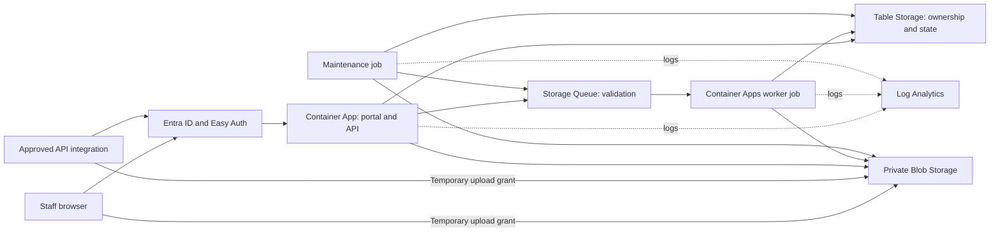

# PDF Validation Portal: Tier 2 and DevOps Runbook

Use this runbook to investigate incidents escalated by Tier 1, operate the Azure Container Apps deployment, and onboard DevOps engineers. Start with the [Tier 1 runbook](runbook-tier-1.md) for user-facing symptoms and basic evidence collection.

**During an incident:** Start at [Section 4](#4-accept-an-incident-and-isolate-the-failure), then use the relevant procedure in [Section 7](#7-component-troubleshooting). **For onboarding:** Follow [Section 12](#12-devops-onboarding-and-practice).

This document describes procedures; it does not authorize production changes. Commands marked **Safe to check** read existing resources. Commands marked **Use caution** require the organization's change or incident approval. Do not run every code block as one script.

## 1. Production Reference and Evidence

| Item | Value |
|---|---|
| Application | PDF Validation Portal |
| Production URL | [Open the portal](https://pdfval-api.calmocean-f7286a46.westus2.azurecontainerapps.io) |
| Repository | [ivanbueno/portal-pdf-validation](https://github.com/ivanbueno/portal-pdf-validation) |
| Resource group | `pdf-validation-prod` |
| Container App | `pdfval-api` |
| Container Apps environment | `pdfval-env` |
| Jobs | `pdfval-worker`, `pdfval-maintenance` |
| Runtime managed identity | `pdfval-runtime` |
| Log Analytics workspace | `pdfval-logs` |
| GitHub deployment environment | `production` |
| Region | Hostname identifies `westus2`; confirm resource location before an operation. |
| Storage account and registry | Names are generated from prefix `pdfval` and a resource-group hash. Confirm through Section 5 inventory before use. |
| Subscription, directory and Entra application IDs | **TBD: Confirm with application owner** |
| Staging subscription/resource group and URL | **TBD: Confirm with application owner**. No staging deployment is defined in the reviewed workflow. |
| Application owner, DevOps on-call, incident lead | **TBD: Confirm with application owner** |
| Identity/security, network and storage contacts | **TBD: Confirm with application owner** |
| Change/restart approver, emergency access process | **TBD: Confirm with application owner** |
| Alert recipient, severity policy and response targets | **TBD: Confirm with application owner** |
| Availability/latency targets, recovery time and acceptable data loss | **TBD: Confirm with application owner** |
| Azure support plan and authorized case opener | **TBD: Confirm with application owner** |

### Where the operational truth lives

| Question | Source |
|---|---|
| What should Azure run? | [Application infrastructure](../infra/main.bicep), [foundation infrastructure](../infra/foundation.bicep) |
| How is it released? | [Deploy workflow](../.github/workflows/deploy.yml), [deployment guide](azure-ci.md) |
| What tests should pass? | [Verify workflow](../.github/workflows/ci.yml), [development guide](development.md) |
| How do requests and errors work? | [API handlers](../src/portal/app.py), [API guide](api.md) |
| How are users authorized? | [Authorization code](../src/portal/auth.py), [integration setup](azure-api.md) |
| How do retry, ownership and cleanup work? | [Domain logic](../src/portal/domain.py), [worker](../src/portal/worker.py), [maintenance](../src/portal/maintenance.py) |
| What limits apply? | [Configuration](../src/portal/config.py), [validation runner](../src/portal/services/runner.py) |
| How is the image built? | [Dockerfile](../Dockerfile), [dependency lock](../requirements.lock), [veraPDF installer](../scripts/install-verapdf.sh) |

Use the current code, current workflow results and fresh smoke tests to establish current behavior.

## 2. Architecture and Failure Boundaries



The Python FastAPI process serves both the built frontend and the API. Java/veraPDF runs in separate worker executions. There is no SQL database, separate frontend hosting service, or Application Insights resource defined by these templates. Storage uses Microsoft Entra credentials through a managed identity, not a production connection string.

### Components and expected configuration

These are repository defaults, not measurements or approved performance targets.

| Component | Expected configuration | Failure impact |
|---|---|---|
| API `pdfval-api` | Container `api`; port 8000; external HTTPS only; single active revision; 0.5 CPU, 1 GiB per replica; 1 to 3 replicas; HTTP scaling at 30 concurrent requests per replica. | Website, API and access to results can fail. |
| Worker `pdfval-worker` | Event job; command `pdf-worker`; one message per execution; 2 CPU, 4 GiB; maximum 4 concurrent executions; poll every 10 seconds; 900-second execution timeout; no platform retry. | PDFs queue or fail processing while the website may stay available. |
| Maintenance `pdfval-maintenance` | Scheduled job; command `pdf-maintenance`; every 2 minutes; 0.5 CPU, 1 GiB; 600-second execution timeout; one platform retry. | Queue dispatch recovery, expired-lease recovery and physical cleanup can fall behind. |
| Blob Storage | Private `documents` container; stores input, pinned input snapshots and reports. | Upload, validation input, PDF viewing and report downloads fail. |
| Table Storage | `validation` table; ownership, lifecycle and report references. | Listing, submission, authorization-by-ownership and progress tracking fail. |
| Queue Storage | `validation` queue; messages identify owner and document. | New validation work may not start. |
| Registry | Basic tier; private image pulls through runtime identity; admin login disabled. | New replicas or executions may fail to start while existing ones still run. |
| Log Analytics | `pdfval-logs`, 30-day retention. | Missing logs reduce visibility; this alone does not prove an application outage. |

### Document lifecycle and automatic recovery

`uploading > queued > running > passed / failed / error`

1. Reservation creates an owner-scoped record and a temporary upload grant. The browser uploads directly to Blob Storage.
2. Submission checks the file and creates a snapshot. It saves the queued state before sending the queue message. This saved record lets maintenance recover an interrupted queue send.
3. A worker claims the record using an ETag, a value that prevents overwriting a record changed by another operation. It gets a new run ID and a 900-second lease, which is its temporary claim on the work.
4. Requested validation profiles run sequentially. Reports are stored under that attempt's run ID. Publishing succeeds only if the record has not changed in the meantime.
5. Infrastructure failures can be retried up to three processing attempts. A validation-rule failure is a completed `failed` result. Profile timeouts, invalid PDFs and engine errors can produce `error` without another processing attempt.
6. Maintenance returns expired running leases to queued and retries dispatch of queued records. Dispatch is throttled to avoid sending again within 120 seconds. It also removes expired/deleted content.

**A job execution marked Succeeded does not prove a PDF passed or even finished successfully.** A worker can exit normally after finding no message, handling an infrastructure failure for later retry, or recording a profile error. Check document state and structured events as well as job history. Conversely, a platform-terminated job may write no application error event.

### Limits that matter during incidents

| Limit | Current default and operational meaning |
|---|---|
| Input | 200 MiB per PDF; browser selection maximum 200 files / 2 GiB. Rejecting a larger file is expected. |
| Profile selection | API defaults to WCAG when omitted. `wcag` and `pdfua1` can be requested together. Do not assume every document ran both. |
| Validation duration | 300 seconds per profile; two profiles can take about 10 minutes plus overhead and queue wait. |
| Worker memory/output | Java heap 2 GiB inside the 4 GiB worker; 20 MiB combined output per profile. Increasing one limit alone may break another. |
| Lease relationship | Configuration requires the lease to exceed all configured profile timeouts combined by at least 120 seconds. Job timeout and queue visibility must also be considered. |
| Upload reservation/grant | One-hour defaults. An expired reservation cannot be repaired by changing its stored expiry. |
| Submitted data | Becomes inaccessible 72 hours after submission. Physical deletion is performed asynchronously by maintenance. |
| Deletion protection | Deleted records remain as tombstones beyond outstanding upload grants and worker leases before metadata removal. Do not remove them manually. |

## 3. Access, Identities and Configuration Ownership

### Keep the three identities distinct

| Identity | Purpose | Where to inspect it |
|---|---|---|
| GitHub deployment identity | Authenticates the release workflow to Azure using OpenID Connect, a short-lived trust exchange. Creates resources and role assignments. | `Azure Portal > Microsoft Entra ID > App registrations > [confirmed deployment registration] > Certificates & secrets > Federated credentials`; `Azure Portal > Resource groups > pdf-validation-prod > Access control (IAM) > Role assignments` |
| Runtime identity `pdfval-runtime` | Lets the API and jobs access Storage and pull images. | `Azure Portal > Managed Identities > pdfval-runtime > Overview`; `Azure Portal > Container Apps > pdfval-api > Settings > Identity` |
| Portal/API Entra registration | Defines browser sign-in, API audience, roles, delegated scope and the Easy Auth credential. | `Azure Portal > Microsoft Entra ID > App registrations > [confirmed portal registration] > Overview`; assignments: `Azure Portal > Microsoft Entra ID > Enterprise applications > [confirmed portal enterprise application] > Users and groups` |

The deployment trust expects issuer `https://token.actions.githubusercontent.com`, subject `repo:ivanbueno/portal-pdf-validation:environment:production`, and audience `api://AzureADTokenExchange`. Compare these exactly when `azure/login` fails. The deployment client ID and portal/API client ID are different values.

The foundation gives the runtime identity Storage Blob Data Contributor, Storage Blob Delegator, Storage Queue Data Contributor and Storage Table Data Contributor at storage-account scope, plus AcrPull at registry scope. Inspect effective assignments at `Azure Portal > Storage accounts > [confirmed account] > Access control (IAM) > Role assignments` and `Azure Portal > Container registries > [confirmed registry] > Access control (IAM) > Role assignments`.

An Azure management role does not automatically prove data access. Successful use of the engineer's account does not prove the runtime identity has access. See [Microsoft's managed identity guide](https://learn.microsoft.com/en-us/azure/container-apps/managed-identity).

### Authentication boundary

Easy Auth is Azure's authentication layer in front of this application. FastAPI trusts the validated principal supplied by that layer. Never expose the Python port through a second ingress/proxy or disable Easy Auth to make a test pass.

- Staff use `Validation.User`. Approved delegated integrations use `Validation.Access`; application integrations use `Validation.Run`.
- Cookie-authenticated write requests require `X-Requested-With: PDFValidationPortal` and must not be cross-site. The portal sets this header. Bearer integrations use the documented API flow.
- Owner identity includes tenant, identity kind and object ID. A different account or recreated integration identity will not own the previous identity's documents.
- The public shell, assets, `/api/config`, `/health/live` and `/health/ready` do not establish an authenticated session. `/api/session` and document APIs remain protected.
- The callback must match the production origin followed by `/.auth/login/aad/callback` and use the Web platform registration type.

Use [the application's authorization source](../src/portal/auth.py) and [Microsoft's Container Apps authentication guide](https://learn.microsoft.com/en-us/azure/container-apps/authentication) when investigating this boundary.

### Configuration and secret ownership

| Location | Settings to recognize | Rule |
|---|---|---|
| GitHub `Settings > Environments > production > Environment variables` | `AZURE_RESOURCE_GROUP`, `AZURE_PREFIX`, `AZURE_SUBSCRIPTION_ID`, `AZURE_TENANT_ID`, `AZURE_DEPLOY_CLIENT_ID`, `API_CLIENT_ID`, `ALERT_EMAIL` | Inspect names and approved non-secret values. Do not change targets during troubleshooting. |
| GitHub `Settings > Environments > production > Environment secrets` | `ENTRA_CLIENT_SECRET` | Secret for portal Easy Auth, not GitHub's deployment login. Never print it. |
| Container App environment variables | `PDF_ENVIRONMENT=production`, `PDF_AUTH_MODE=easyauth`, `PDF_STORAGE_ACCOUNT`, `PDF_TENANT_ID`, `PDF_AUDIENCE`, `AZURE_CLIENT_ID` | Defined in Bicep and shared with the jobs. Compare only relevant non-secret settings. |
| Container App secret | `entra-client-secret` | Used by the platform's authentication configuration. Do not dump secret values or put them in shell history. |
| Python defaults | Timeouts, lease, retention and validation profiles | Defaults in code may not be displayed as Azure environment variables. Check the deployed version's source. |

**Safe to check:** Resource/log read access, GitHub workflow visibility and approved Entra log access. Request missing access through the normal process. Do not use the deployment identity as an engineer's general login.

**Use caution:** Restart, job execution, deployment, identity, networking, data and configuration changes need explicit scope and approval. A job-operator role can be more powerful than its name suggests; have the access owner review exact permissions. Microsoft documents job permissions and their implications in the [jobs guide](https://learn.microsoft.com/en-us/azure/container-apps/jobs).

## 4. Accept an Incident and Isolate the Failure

**Safe to check.** Take ownership of the Tier 1 handoff without requiring every field to be complete. For broad outage, security concerns or possible loss of unexpired data, engage the incident lead immediately.

1. Record impact, first failure, last known good time, affected action, affected users and an example request/document ID. Convert the timeline to UTC.
2. Confirm the subscription, resource group and hostname. Check the currently serving revision, not just the most recently created one.
3. Reproduce one safe read using your own approved account. Do not blindly repeat a reservation, upload or delete.
4. Use the table below to choose a component. Inspect the 15 minutes before the first failure through now.
5. Compare deployment and management changes with the incident. Record evidence supporting and contradicting the suspected cause.
6. Decide on a specific approved mitigation, or escalate with the missing evidence. Set an owner and next update time.

| Observation | Likely investigation boundary | Next check |
|---|---|---|
| Hostname does not resolve or TLS warning occurs | DNS, certificate, client network or Azure ingress | Compare correct hostname on approved networks; inspect Custom domains if configured; involve network/DevOps. |
| `/health/live` fails | Ingress, replica startup, crash or platform | Serving revision, ready replicas, System logs. |
| Liveness passes; `/health/ready` fails | Blob, Queue or Table access | `storage_unavailable`, runtime identity, Storage health and configuration. |
| Health passes; sign-in fails | Entra/Easy Auth | Sign-in error, callback, roles, credential expiry and authentication changes. |
| Sign-in works; upload fails | Reservation API or direct Blob upload | Identify the failing host and HTTP code; inspect grant expiry and storage CORS. |
| Submission appears failed but document is queued | Queue send may have failed after state was saved | Poll the existing document; inspect maintenance and queue dispatch before retrying writes. |
| Documents stay queued | Scaler, worker startup, queue access or capacity | Worker executions, environment System logs, queue trend and attempts. |
| Documents stay running | Slow profile, worker crash or lease recovery | Start time, lease, job termination and maintenance progress. |
| Results exist but pages/reports fail | Ownership, expiry, Blob reads or application defect | Request ID, document state and affected route. |

Portal paths: `Azure Portal > Container Apps > pdfval-api > Application > Revisions and replicas`; `Azure Portal > Container Apps > pdfval-api > Monitoring > Log stream`; `Azure Portal > Service Health > Service issues`. Some portal versions call the revision page `Revision management` or the service issue page `Incidents`. Use the resource menu's search if a label differs. Stop if the resource cannot be identified confidently.

## 5. Read-Only Diagnostic Toolkit

### 5.1 Confirm the target before using Azure CLI

**Safe to check.** Use an approved workstation with Azure CLI and GitHub CLI already configured. The examples use Bash-compatible syntax. Replace placeholder values before use. Do not enable command tracing (`set -x`) or `--debug` while handling authenticated requests.

```sh
az account show --query '{subscription:name,id:id,tenant:tenantId}' --output table
gh auth status

RUNBOOK_SUBSCRIPTION='REPLACE_WITH_OWNER_CONFIRMED_SUBSCRIPTION_ID'
RUNBOOK_RG='pdf-validation-prod'
RUNBOOK_APP='pdfval-api'
RUNBOOK_REPO='ivanbueno/portal-pdf-validation'
```

Compare the account output with the owner-confirmed subscription and directory. Every Azure resource command below supplies `--subscription` explicitly. If access fails, record the command name and sanitized error. Do not change role assignments or install extensions during a production incident without following the team's tooling process.

### 5.2 Inventory and serving revision

```sh
az resource list --subscription "$RUNBOOK_SUBSCRIPTION" \
  --resource-group "$RUNBOOK_RG" \
  --query '[].{name:name,type:type,location:location}' --output table

az containerapp show --subscription "$RUNBOOK_SUBSCRIPTION" \
  --resource-group "$RUNBOOK_RG" --name "$RUNBOOK_APP" \
  --query '{state:properties.provisioningState,fqdn:properties.configuration.ingress.fqdn,mode:properties.configuration.activeRevisionsMode,latest:properties.latestRevisionName,ready:properties.latestReadyRevisionName,traffic:properties.configuration.ingress.traffic}' \
  --output json

az containerapp revision list --subscription "$RUNBOOK_SUBSCRIPTION" \
  --resource-group "$RUNBOOK_RG" --name "$RUNBOOK_APP" \
  --query '[].{name:name,active:properties.active,health:properties.healthState,running:properties.runningState,replicas:properties.replicas,created:properties.createdTime,images:properties.template.containers[].image}' \
  --output json
```

Expected template state is Single revision mode with ready API replicas. An attempted deployment can leave the older revision serving while a newer one fails. Confirm the traffic and health together. If CLI fields are missing, use the Portal rather than assuming a missing value means healthy. See [Container Apps CLI](https://learn.microsoft.com/en-us/cli/azure/containerapp?view=azure-cli-latest) and [revision behavior](https://learn.microsoft.com/en-us/azure/container-apps/revisions).

Find the storage account and registry in the inventory. Cross-check the account against `Azure Portal > Container Apps > pdfval-api > Application > Containers > api > Environment variables > PDF_STORAGE_ACCOUNT`. Do not select Edit or Save while reading.

### 5.3 Health and anonymous access

Use the owner-confirmed Application URL. These requests send no tokens and make no application data changes.

```sh
RUNBOOK_ORIGIN='https://pdfval-api.calmocean-f7286a46.westus2.azurecontainerapps.io'
curl --silent --show-error --connect-timeout 5 --max-time 20 \
  --write-out '\nHTTP %{http_code}; total %{time_total}s\n' "$RUNBOOK_ORIGIN/health/live"
curl --silent --show-error --connect-timeout 5 --max-time 20 \
  --write-out '\nHTTP %{http_code}; total %{time_total}s\n' "$RUNBOOK_ORIGIN/health/ready"
curl --silent --show-error --connect-timeout 5 --max-time 20 \
  --output /dev/null --write-out 'Anonymous session: HTTP %{http_code}\n' \
  "$RUNBOOK_ORIGIN/api/session"
```

Expect liveness 200 with `status: ok`, readiness 200 with `status: ready`, and anonymous session 401. Readiness checks container properties, queue properties and a Table query. It does not test Blob write/delegation permissions, browser CORS, Entra login, worker scaling or report generation. A connection timeout is evidence too; do not loop these probes under load.

### 5.4 Job executions and deployed images

```sh
az containerapp job execution list --subscription "$RUNBOOK_SUBSCRIPTION" \
  --resource-group "$RUNBOOK_RG" --name pdfval-worker \
  --query '[].{name:name,status:properties.status,start:properties.startTime,end:properties.endTime}' \
  --output table
az containerapp job execution list --subscription "$RUNBOOK_SUBSCRIPTION" \
  --resource-group "$RUNBOOK_RG" --name pdfval-maintenance \
  --query '[].{name:name,status:properties.status,start:properties.startTime,end:properties.endTime}' \
  --output table
az containerapp job show --subscription "$RUNBOOK_SUBSCRIPTION" \
  --resource-group "$RUNBOOK_RG" --name pdfval-worker \
  --query '{images:properties.template.containers[].image,trigger:properties.configuration.triggerType,timeout:properties.configuration.replicaTimeout,retries:properties.configuration.replicaRetryLimit}' \
  --output json
```

Repeat the final image query for `pdfval-maintenance` when checking a release. The API and both job definitions should reference the intended commit tag. Existing job executions may have started on an older release; record their start times. The CLI reference is [job execution list](https://learn.microsoft.com/en-us/cli/azure/containerapp/job/execution?view=azure-cli-latest).

Portal: `Azure Portal > Container App Jobs > [job] > Monitoring > Execution history > [execution] > View logs`. Use saved logs for older executions and for application outcomes, not just platform status.

### 5.5 Release and change history

```sh
gh run list --repo "$RUNBOOK_REPO" --workflow deploy.yml --limit 5 \
  --json databaseId,createdAt,updatedAt,headSha,status,conclusion,url
gh run list --repo "$RUNBOOK_REPO" --workflow ci.yml --limit 5 \
  --json databaseId,createdAt,headSha,status,conclusion,url
az deployment group list --subscription "$RUNBOOK_SUBSCRIPTION" \
  --resource-group "$RUNBOOK_RG" \
  --query '[].{name:name,state:properties.provisioningState,time:properties.timestamp}' \
  --output table
```

Do not attach full deployment output or parameters to a ticket. Use GitHub `Actions > Deploy Azure > [run] > deploy > [step]` for a specific failure and sanitize its excerpt. Resource-group deployments named `portal` and `foundation` are reused, so GitHub is needed for historical release records.

For resource changes, go to `Azure Portal > Resource groups > pdf-validation-prod > Activity log`, select the incident window and all statuses, then open relevant events. Record operation, caller, resource, UTC time and correlation ID. For identity changes, use `Azure Portal > Microsoft Entra ID > Monitoring & health > Audit logs`. Activity Log does not capture every application action or automatic restart.

## 6. Logs, Metrics and Alerts

### 6.1 Query procedure

**Safe to check.** Go to `Azure Portal > Log Analytics workspaces > pdfval-logs > Logs`. Close the query gallery if shown and select the query editor or KQL mode. KQL is the language used to search Azure logs. Paste one query and select Run.

The queries use the table configured by the repository. Set both the query and portal time window to the incident's UTC period. A missing table, delayed ingestion, wrong workspace or permission problem can produce no results. Record that as a visibility gap, not a clean bill of health. Schema guidance: [Container Apps saved logs](https://learn.microsoft.com/en-us/azure/container-apps/log-monitoring).

**Request errors and latency by five-minute interval:**

```kusto
ContainerAppConsoleLogs_CL
| where TimeGenerated > ago(1h)
| where ContainerAppName_s == "pdfval-api"
| extend e = parse_json(Log_s)
| where tostring(e.event) == "request"
| summarize requests=count(),
    errors4xx=countif(toint(e.status) between (400 .. 499)),
    errors5xx=countif(toint(e.status) >= 500),
    average_ms=avg(todouble(e.duration_ms)),
    p95_ms=percentile(todouble(e.duration_ms), 95)
    by bin(TimeGenerated, 5m), RevisionName_s
| extend error5xx_percent=round(100.0 * errors5xx / requests, 2)
| order by TimeGenerated asc
```

`p95_ms` means 95% of recorded requests completed within that time. Health probes are included, and the app deliberately omits paths from structured request logs. This is not a route-specific or browser-experience chart. Requests rejected upstream may never reach these logs.

**One request across API replicas:** Replace the placeholder with a captured `X-Request-ID` response header.

```kusto
let requestId = "REPLACE_WITH_REQUEST_ID";
ContainerAppConsoleLogs_CL
| where TimeGenerated > ago(1h)
| where ContainerAppName_s == "pdfval-api"
| extend e = parse_json(Log_s)
| where tostring(e.request_id) == requestId
| project TimeGenerated, RevisionName_s, request_id=tostring(e.request_id),
    status=toint(e.status), duration_ms=toint(e.duration_ms), error=tostring(e.error)
| order by TimeGenerated asc
```

**Document processing timeline:** Document events have a document ID, not the API request ID. Link them using the affected document reported by its owner. Do not assume an Azure execution ID equals a document ID.

```kusto
let documentId = "REPLACE_WITH_DOCUMENT_ID";
ContainerAppConsoleLogs_CL
| where TimeGenerated > ago(24h)
| extend e = parse_json(Log_s)
| where tostring(e.document_id) == documentId
| project TimeGenerated, event=tostring(e.event), attempt=toint(e.attempt),
    status=tostring(e.status), document_id=tostring(e.document_id)
| order by TimeGenerated asc
```

**Infrastructure and maintenance signals:**

```kusto
ContainerAppConsoleLogs_CL
| where TimeGenerated > ago(1h)
| extend e = parse_json(Log_s)
| where tostring(e.event) in (
    "storage_unavailable", "validation_infrastructure_error",
    "invalid_queue_message", "maintenance_finished", "step_failed")
| project TimeGenerated, event=tostring(e.event), failures=toint(e.failures),
    error_type=tostring(e.type), document_id=tostring(e.document_id)
| order by TimeGenerated desc
| take 200
```

`maintenance_finished` with zero failures is a successful sweep, not proof that every document is complete. `step_failed` belongs to loop mode used locally; repeated production occurrences merit checking whether a job command was changed. Platform crashes need System logs even when these application events are absent.

For an older window, replace `TimeGenerated > ago(1h)` with an explicit filter such as `TimeGenerated between (datetime(2026-09-28T18:45:00Z) .. datetime(2026-09-28T19:15:00Z))`, using the incident's actual times.

### 6.2 Metrics and live events

| Investigation | Exact Portal path and selection | Interpretation |
|---|---|---|
| Gateway/application HTTP errors | `Azure Portal > Container Apps > pdfval-api > Monitoring > Metrics > Requests`; Sum; split by Status Code Category, then Status Code. | Compare failed counts to total requests. Expected unauthenticated 401s and expired-document 404s need context. |
| CPU or memory pressure | `Azure Portal > Container Apps > pdfval-api > Monitoring > Metrics`; CPU Usage and Memory Working Set Bytes; split by Replica and filter revision. | Compare each replica with its own configured limit and a healthy period. One core is 1,000,000,000 nanocores; bytes are not a percentage. |
| Restart loop | `Azure Portal > Container Apps > pdfval-api > Monitoring > Metrics > Total Replica Restart Count`; also `Azure Portal > Container Apps > pdfval-api > Monitoring > Log stream > System`. | Match restarts with health-check failures, memory termination and deployment times. |
| Live application error | `Azure Portal > Container Apps > pdfval-api > Monitoring > Log stream > Console`; select revision, replica and `api`. | Observe one safe reproduction; capture its time and request ID. An idle replica may emit nothing. |
| Environment/scaler failure | `Azure Portal > Container Apps Environments > pdfval-env > Monitoring > Log stream` | Look for image pull, identity, scheduling or scaler failures near the job incident. |
| Data-service failure | `Azure Portal > Storage accounts > [confirmed account] > Monitoring > Metrics`; relevant Blob/Queue/Table namespace. | Compare Transactions by Response type, Availability and latency where offered. Metrics can lag. |

The API's resource metrics do not represent the Java worker's use. For jobs, use each job's Metrics and Execution history pages. See [Container Apps metrics](https://learn.microsoft.com/en-us/azure/container-apps/metrics) and [log streams](https://learn.microsoft.com/en-us/azure/container-apps/log-streaming).

### 6.3 Existing alert coverage and gaps

Go to `Azure Portal > Monitor > Alerts`, filter resource group `pdf-validation-prod`, and open the alert. Inspect definitions at `Azure Portal > Monitor > Alerts > Alert rules`. Inspect recipients at `Azure Portal > Monitor > Alerts > Action groups > pdfval-alerts`. Reading an alert does not authorize disabling it.

| Alert | Repository condition | What it can miss |
|---|---|---|
| `pdfval-processing-failures` | Every 5 minutes over 15 minutes: infrastructure error or maintenance failure count above zero. | Deterministic profile errors, missing telemetry, some platform terminations. |
| `pdfval-queue-backlog` | Average QueueMessageCount above 1,000 over an hour. | Small, sudden or stuck backlogs. Do not wait for this alert to investigate stalled work. |
| `pdfval-worker-failed` | Failed platform executions in a 5-minute window. | A successful execution that records an application error or processes nothing. |
| `pdfval-maintenance-failed` | Failed platform executions in a 5-minute window. | Missing scheduled executions without a failure record. |

The action group has no email recipient if `ALERT_EMAIL` is empty. Log-alert query validation is skipped during provisioning, so deployment success alone does not validate its query or delivery. No synthetic availability, login, per-route latency or cleanup-lag alert is defined in the reviewed templates. Have the owner approve gaps and thresholds before adding coverage.

## 7. Component Troubleshooting

Each procedure ends with a decision. Preserve evidence before recovery actions, and do not make unrelated changes while testing a hypothesis.

### 7.1 API down, 500, 502 or 503

**Safe to check:**

1. Run Section 5's health and revision checks. A successful resource provision is not proof of ready replicas.
2. Open `Azure Portal > Container Apps > pdfval-api > Monitoring > Log stream > System`. For an image-pull failure, check the image tag, registry health and runtime AcrPull assignment. For a crash, compare the first failure with the deployed code/configuration.
3. Inspect Console/saved request logs. `500` with an exception type points toward application code; `storage_unavailable` and readiness failures point toward data access.
4. Compare CPU, memory and restarts. Inspect `Azure Portal > Service Health > Service issues` for matching service/region impact.

**Good:** Serving replicas are ready, health succeeds and the affected authenticated action works. **Escalate:** Developers for repeatable application exceptions; DevOps/platform for unhealthy replicas; storage/identity owner for failed dependency access. Consider one approved restart only under Section 9, not during a crash loop or dependency outage.

### 7.2 Queued documents do not start

**Safe to check:**

1. Confirm the record is `queued`, not `uploading`. Submission must finish before worker processing starts. Obtain metadata through the owner's existing UI/API session; do not access arbitrary users' data.
2. Inspect `Azure Portal > Container App Jobs > pdfval-worker > Monitoring > Execution history`. Zero executions with an empty queue is normal; queued documents without progress need investigation.
3. Compare starts/finishes over time with the maximum four concurrent executions. Check environment System logs for queue scaler authentication, image pull, quota or scheduling errors.
4. Inspect runtime Queue/Table/Blob roles and the job's configured storage account. Ready API health alone does not prove worker configuration is correct.
5. Check `pdfval-maintenance` execution history and recent `maintenance_finished` events. It recovers queued records whose queue send was interrupted.

**Good:** New jobs start and document states advance. **Escalate:** DevOps for scaler/start failures, developers for dispatch/state inconsistencies. Do not dequeue, purge or fabricate queue messages. Scaling up workers is a reviewed capacity change, not a first diagnostic step.

### 7.3 Running documents do not finish

**Safe to check:**

1. Record the document ID, current attempt and `validation_started` time. Compare with profile count, 300-second profile limits and the 900-second lease/job timeout.
2. Inspect execution logs for memory termination, engine failures or timeout. Inspect maintenance around the lease expiry.
3. Check for later `validation_finished`, another attempt, or an `error` state. Retries can explain more than one start for the same document.
4. If state details are unavailable through approved APIs, ask a developer/data owner for narrowly scoped read-only metadata. Do not browse PDFs or change Table entities to force progress.

**Good:** The result completes, or the automatic recovery mechanism moves failed work through another attempt. **Escalate:** A lease has expired and successful maintenance cycles still do not reconcile the record, attempts are exhausted, or the pattern affects multiple documents. Do not extend leases or reset attempts manually.

### 7.4 PDF processing error or failed validation

**Safe to check:**

1. Distinguish `failed` from `error` for each requested profile. A validation-rule failure is a completed report and requires accessibility review, not an Azure repair.
2. For `error`, record profile, sanitized error, attempt and document ID. Known cases include encrypted/malformed input, engine unavailable, profile timeout and output limit.
3. Compare with an approved non-sensitive fixture in a local/test environment. Do not download the reporter's PDF for local analysis without the required data authorization.
4. Check whether errors affect one file or all files after a release. One profile may succeed while another fails; preserve the successful report.

**Good:** Expected fixture outcomes and stable processing. **Escalate:** Developers for engine/profile regressions; DevOps for resource/startup failures. Do not increase timeout, Java heap, report limit or memory independently. Review their combined effect and test before release.

### 7.5 Login, 401 or 403

**Safe to check:**

1. Capture the Entra error, timestamp and correlation ID. Use `Azure Portal > Microsoft Entra ID > Monitoring & health > Sign-in logs`, filtered to the confirmed application and incident window.
2. Inspect `Azure Portal > Container Apps > pdfval-api > Settings > Authentication`; verify Microsoft provider, enabled authentication, configured audience and protected paths against Bicep.
3. At `Azure Portal > Microsoft Entra ID > App registrations > [portal registration] > Authentication`, compare the callback. At `Certificates & secrets`, inspect expiry metadata only.
4. At `Azure Portal > Microsoft Entra ID > Enterprise applications > [portal enterprise application] > Users and groups`, verify the intended staff assignment. Use [integration setup](azure-api.md) for application permission/admin-consent checks.
5. Separate missing/expired session (401), missing role/scope (403), and cookie write protection (403). A pre-login 401 is expected.

**Good:** Assigned staff and approved integrations work; unauthorized callers remain denied. **Escalate:** Identity owner for policy/assignment/credential problems, developers for authorization behavior, security immediately if unauthorized access succeeds. Never forge trusted principal headers or disable authentication for troubleshooting.

### 7.6 Upload fails, CORS error or submission returns 409/503

**Safe to check:**

1. In the browser Network panel, identify whether reservation API, Blob PUT/OPTIONS or submission failed. Capture only status, hostname, path without query string, UTC time and request ID. Upload query strings are credentials.
2. Check file size, PDF format, selected account and reservation age. A 409 can mean upload incomplete, mismatched size, already finalized state or conflicting idempotency metadata.
3. Inspect `Azure Portal > Storage accounts > [confirmed account] > Settings > Resource sharing (CORS) > Blob service`. The reviewed template permits the exact portal origin, PUT/OPTIONS and required headers. Read only; a wildcard origin is not a repair.
4. Check Blob data and delegation permissions. Readiness can succeed even if generating an upload grant or writing a blob fails.
5. For 503 after submission, poll the existing document first. Queued state can be durable even if queue dispatch failed. Use the documented idempotent submit operation or allow maintenance to recover it; do not create a second reservation blindly.

**Good:** Reservation, direct upload and submission complete, then processing advances. **Escalate:** DevOps for origin/permission drift, developers for repeatable valid-input conflicts. Reuse the original idempotency key with identical metadata when retrying reservation; if the original response/key was lost, first determine whether a record was created. See [API retry rules](api.md).

### 7.7 Storage unavailable or permissions changed

**Safe to check:**

1. Inspect `Azure Portal > Storage accounts > [confirmed account] > Resource health`, Metrics and Activity log for the incident window.
2. Match the failing service: Blob, Queue or Table. Record the SDK error type, request/operation time and runtime identity object ID.
3. Verify the identity is assigned to the API and both jobs, and `AZURE_CLIENT_ID` selects it. Compare Storage role assignments and any recent network policy changes.
4. Compare declared configuration with the current release. Shared-key access is disabled and production code rejects storage connection strings.

**Good:** Expected runtime identity accesses the required data services and readiness succeeds. **Escalate:** Identity/storage owner for permission or network repair, Azure support through DevOps for platform failure. Do not enable shared keys, make blobs public or add broad roles as a workaround.

### 7.8 Slow pages, high CPU/memory or repeated restarts

**Safe to check:**

1. Separate API response time, browser rendering, upload transfer and PDF processing wait. They use different components.
2. Split API CPU/memory by replica/revision. Match peaks and restart events to traffic and the last release.
3. Compare lightweight active-state polling with document-list/filter/totals calls. Exact owner totals and filename filtering can require scanning that owner's live metadata; not every read has the same cost.
4. For workers, inspect job resources and platform termination messages. Java heap is only part of total container memory.
5. Check downstream latency before proposing more compute. Determine whether retries or repeated user submissions amplify load.

**Good:** Representative actions recover toward their healthy baseline without resource terminations. **Escalate:** Developers for repeated expensive operations/leaks, DevOps for capacity/quota. No numerical service target is approved here. Any scale change needs expected benefit, cost, downstream capacity, validation and reversal criteria.

### 7.9 Missing results, 404 or cleanup failure

**Safe to check:**

1. Check the same owner, submission time, expiry and any user deletion. Missing, expired, deleted and other-owner documents deliberately return the same 404.
2. For an unexpired, owned document, inspect processing state and report errors. A 409 can mean its report is not yet available.
3. For cleanup, inspect `Azure Portal > Container App Jobs > pdfval-maintenance > Monitoring > Execution history` and `maintenance_finished` failure counts. Expired data may be inaccessible before physical cleanup finishes.
4. Preserve the timeline and route unexpected missing data to Section 11 immediately.

**Good:** Owned live results work and maintenance completes. **Escalate:** Developers/storage owner for missing unexpired artifacts or repeated cleanup failure. Do not reassign ownership, edit expiry, remove tombstones or copy one user's reports into another record.

### 7.10 DNS, TLS or Azure-wide incident

**Safe to check:** Compare the confirmed Application URL, browser error and approved-network results. Inspect `Azure Portal > Container Apps > pdfval-api > Overview > Application URL`. If a custom hostname is confirmed, inspect `Azure Portal > Container Apps > pdfval-api > Settings > Custom domains`. Check `Azure Portal > Service Health > Service issues` for matching region/services; use [Azure status](https://azure.status.microsoft) if the portal is inaccessible.

**Good:** Correct hostname and trusted HTTPS reach the intended app. **Escalate:** Network/DevOps for resolution or certificate issues; security for suspicious certificates; authorized Azure support owner for platform impact. Do not bypass TLS warnings, change DNS or initiate a regional migration as an experiment.

## 8. Releases, Failed Deployments and Rollback

### 8.1 Understand the release workflow

The repository's approved deployment mechanism is **GitHub Actions > Deploy Azure**. Follow [azure-ci.md](azure-ci.md). Do not provision Bicep, build/push production images or change image tags by hand as an alternate release path.

| Workflow step | What it does | Investigate on failure |
|---|---|---|
| Azure login | Exchanges GitHub OIDC identity for Azure access. | Environment name, federated subject, tenant, subscription and deployment client ID. |
| Compile infrastructure | Builds `infra/main.bicep`. | Bicep syntax/tooling and the selected source commit. |
| Provision foundation | Creates/updates identity, registry, storage, logs and environment; derives existing portal origin. | Missing provider registration, deployment permissions, name/quota errors and failed Azure operation. |
| Build immutable release image | ACR builds the repository and tags `pdf-validation:<Git SHA>`. | Registry task logs, dependency downloads, installer checksum, frontend/image build. |
| Deploy application | Reapplies infrastructure/authentication and updates API and both job definitions. | Runtime identity, secret presence, image startup, infrastructure error and source compatibility. |
| Update foundation origin | Reapplies storage CORS using the deployed hostname. | Origin mismatch, permissions or partial deployment. |
| Readiness check | Retries `/health/ready`. | API readiness and Storage access. It is not a full user or authentication test. |

GitHub serializes deployments with concurrency group `azure-production` and does not cancel an in-progress deployment. Verify the queue before starting another. A failed run can leave successful earlier steps and partial production changes.

### 8.2 Approved release procedure

**Use caution. Production change.**

1. Obtain the release/change reference, approver, approved branch or tag, expected full commit ID, operator, maintenance impact and rollback candidate.
2. Inspect **Verify** for that exact commit. The Deploy Azure workflow does not declare a dependency on Verify, so check it explicitly. Investigate failed/skipped required checks before release.
3. Record the serving API revision, API/job image tags, available registry digest information, queue progress and current health. Confirm no conflicting deployment or incident action is underway.
4. Review changes to Bicep, authentication, profiles, metadata/report format and maintenance behavior. Existing queued data and running jobs must remain compatible.
5. In GitHub, open `Actions > Deploy Azure > Run workflow`, choose the approved ref and start once. Verify the created run's `headSha` matches the approved commit before treating it as the intended release.
6. Watch every step and the Azure operation details. Record the run URL and times. If a failure occurs, use Section 8.3 rather than immediately starting another run.
7. Complete Section 10's smoke checks and an agreed observation window. Record customer-visible recovery, not just a green workflow.

For experienced operators using the CLI, an approved existing branch/tag can be selected with `gh workflow run deploy.yml --repo ivanbueno/portal-pdf-validation --ref <approved-branch-or-tag>`. This starts a production deployment. `--ref` is documented for a branch or tag, so do not assume a bare commit hash will be accepted. See [GitHub's workflow command](https://cli.github.com/manual/gh_workflow_run).

### 8.3 Failed deployment decision

1. Identify the exact failed step and Azure operation. Record the run commit and which steps already succeeded.
2. Recheck the serving API revision and **both jobs' definitions and executions**. A failed rollout does not imply every component remains on the previous version.
3. If users are unaffected and the previous API revision is healthy, preserve service while the owning team repairs the release. Do not deactivate it to force progress.
4. If the failure is a missing permission/provider or propagation delay, have the authorized owner correct the specific cause and approve a rerun. A rerun is still a deployment, including infrastructure reapplication.
5. If application behavior regressed, decide between a reviewed fix-forward and compatible rollback. Preserve evidence before either action.

### 8.4 Approved rollback

**Use caution. Rollback is another release, not a data restore.**

1. Identify a previously working, compatible code **and infrastructure** revision. Review its workflow and Bicep for security/configuration regressions.
2. Have developers confirm compatibility with current Table entities, Blob snapshots/report formats, queue payloads and in-flight executions. An API-only revision switch does not roll back jobs or shared settings.
3. Select an existing approved branch/tag for the target, or have the authorized repository owner create the approved release ref through the normal process. Do not move shared branches casually.
4. Run **Deploy Azure** for that ref. Check its `headSha`, completion, serving revision and API/worker/maintenance image tags.
5. Repeat Section 10 and monitor processing through the agreed window. Stop if ownership, data compatibility, security or loss concerns appear; involve developers and the incident lead.

The workflow rebuilds an image using the selected commit tag. A Git SHA tag identifies source; this workflow does not enforce registry tag locking or digest-pinned deployment. A rebuilt image can differ because external build inputs can change. Capture the previous digest when available and do not promise byte-for-byte restoration. Exact-image recovery would require an owner-approved procedure beyond the current workflow.

Never delete the resource group, overwrite data or disable authentication as a rollback method.

## 9. Approved Recovery and Configuration Changes

### 9.1 Restart the serving API revision once

**Use caution. Production action.** Appropriate only for an unresponsive process when evidence is saved, dependencies appear available and the incident approver authorizes a restart of the exact revision. It is not a fix for bad code, a crash loop, missing roles, DNS/TLS or unavailable Storage.

Before restarting, record errors/time, impact, serving revision/replicas, logs, CPU/memory, latest deployment, dependency status, approval and observation window. Do not restart during deployment, security investigation or possible data loss without explicit incident-lead direction.

1. Go to `Azure Portal > Container Apps > pdfval-api > Application > Revisions and replicas` and identify the active revision serving traffic.
2. Use its Restart action if available, or the reviewed CLI command below. Do not substitute Stop, Deactivate, Delete or Create new revision.
3. Record the time and observe ready replicas, new logs, errors and the original user action.

```sh
# Production mutation. Run only after approval and target verification.
RUNBOOK_REVISION='REPLACE_WITH_APPROVED_SERVING_REVISION'
az containerapp revision restart --subscription "$RUNBOOK_SUBSCRIPTION" \
  --resource-group "$RUNBOOK_RG" --name "$RUNBOOK_APP" \
  --revision "$RUNBOOK_REVISION"
```

This restarts the API revision, not worker or maintenance executions. Command reference: [revision restart](https://learn.microsoft.com/en-us/cli/azure/containerapp/revision?view=azure-cli-latest#az-containerapp-revision-restart).

**Do not repeatedly restart the application. If one approved restart does not fix the problem, collect the information and escalate.**

### 9.2 Worker and maintenance recovery

Prefer fixing the identified dependency and observing built-in dispatch/lease recovery. Re-running maintenance is a data-changing operation: it can delete expired blobs and remove tombstones. Starting a worker can consume production messages. Stopping an execution can leave work waiting for lease recovery.

Before any approved manual job action, record job/execution, affected documents, current attempts, lease timing, expected data changes, identity/secret use and rollback limits. Have the developer or service owner provide the incident-specific procedure. This runbook intentionally does not treat arbitrary job replay or direct state edits as a standard repair.

### 9.3 Configuration, capacity and credential changes

Use a reviewed change to the repository and **Deploy Azure** for application/infrastructure changes. Explain the triggering symptom, exact setting, expected effect, cost/dependency impact, validation and reversal criteria. Emergency drift must be documented and reconciled with source before the next deployment.

For an approved Easy Auth credential rotation, the identity owner creates the replacement credential, the release owner updates GitHub's `ENTRA_CLIENT_SECRET` through the approved secret-handling process, and the approved workflow reapplies it to Azure. Validate sign-in before retiring the old credential unless security requires immediate revocation. Never print secret values, place them in issue comments, or invent a broad credential-reset fix.

## 10. Verify Recovery or a Release

**Safe to check** for status/read operations. **Use caution** for test uploads, deletion and negative authorization tests: use approved test accounts and non-sensitive fixtures in the confirmed test environment, or obtain production smoke-test approval. Do not use real customer PDFs as test fixtures.

| Check | Expected result | Evidence |
|---|---|---|
| Deployment and versions | Correct approved commit; healthy serving API revision; intended API and both job images. | Run link, SHA, revision and tags/digests where available. |
| Health | Liveness 200/ok and readiness 200/ready. | UTC times and response codes. |
| Anonymous access | Public shell is reachable; protected session/document endpoints deny anonymous access. | Codes without cookies/tokens. |
| Authorized user | Assigned staff signs in, views workspace and signs out. | Account alias approved for the ticket and result, not credentials. |
| Unassigned/wrong-owner access | Approved negative test remains denied; account B cannot read account A's test document. | Sanitized test IDs and codes. |
| Upload and submit | Small approved PDF uploads directly, submission creates queued work, and no duplicate record is created by a documented retry. | Document ID, selected profiles, state/timing. |
| Processing | Worker runs; profile outcomes match the known fixtures. A known failing fixture should produce `failed`, not be forced to pass. | Events, execution and result states. |
| Reports | Owner can view the submitted PDF and retrieve available JSON/XML reports. | Status and profile availability; no document contents in ticket. |
| Maintenance | Scheduled executions succeed and sweep failure counts are zero. | Execution times and events. Test expiry/physical deletion in an approved test environment. |
| Integrations, if used | Approved token flow succeeds and agreed invalid/missing-role cases fail. | Sanitized codes and integration identity, never token text. |
| Monitoring | Fresh logs arrive; no new incident pattern; alert delivery confirmed by an approved test. | Query window, alert/action-group test result. |
| User recovery | Original failing action works and reporter confirms usability. | Action, time and observation window. |

Do not declare full recovery from `/health/ready` alone. Record checks not performed, their risk and the owner accepting follow-up. New tests, limits or monitoring settings are not implied by a successful smoke test.

## 11. Data Loss, Security and Disaster Recovery

**Escalate immediately** for possible unauthorized access, leaked credentials, unexplained loss of unexpired data or widespread corruption. Stop routine writes and restarts while the incident lead/security team decides containment. Preserve minimal relevant evidence through restricted channels; do not explore exposed data to assess its contents.

The templates configure locally redundant Storage. They do not enable backups, blob versioning or soft delete. The input snapshot pins the submitted file for validation; cleanup deletes snapshots with their blobs, so it is not a disaster-recovery backup. No multi-region failover or tested restore procedure is supplied.

1. Separate expected 72-hour expiration or user deletion from unexpected loss. Check the authenticated owner and identity changes first.
2. Record affected IDs, submission/expiry, last known access, first failure, deployments and management changes. Do not change expiry or recreate records.
3. Ask the storage/incident owner to confirm actual protection settings at `Azure Portal > Storage accounts > [confirmed account] > Data management > Data protection`. Read-only inspection does not establish that recovery is possible.
4. Escalate any recovery proposal for review of original input, snapshots, metadata, reports and ownership together. Recreating infrastructure does not recover deleted data.
5. Define a recovery test in an isolated approved environment before using any restore method in production. Record what cannot be recovered and communicate through the incident lead.

Recovery time objective, acceptable data loss, backup owner, tested restore evidence and regional recovery plan are **TBD: Confirm with application owner**. Do not promise a recovery time until they are established.

Never attach raw deployment exports, authentication headers, browser cookies, tokens, connection strings, temporary upload URLs or PDFs to a general ticket. Redact query strings and sensitive fields. The app minimizes structured logging, but platform traces and screenshots still need review.

## 12. DevOps Onboarding and Practice

### 12.1 First-day access and orientation

Complete with a mentor before taking independent production on-call responsibility.

- [ ] Obtain named read access to the resource group, Log Analytics, GitHub workflows and approved Entra logs. Record the separate production-change process.
- [ ] Confirm subscription/directory, contacts, alert recipient, incident severity rules and emergency access. Resolve Section 1 TBDs or assign owners and due dates.
- [ ] Trace a document through the architecture in Section 2 and explain why health, job status and PDF outcome are different signals.
- [ ] Identify the deployment identity, runtime identity and portal registration without revealing a secret.
- [ ] Find the serving revision and both job image tags; relate them to a GitHub commit.
- [ ] Read [how-it-works.md](how-it-works.md), [azure-ci.md](azure-ci.md), [api.md](api.md) and the source map in Section 1.
- [ ] Run the read-only inventory and inspect one request timeline with the mentor. Record permission/visibility gaps.

Do not provision a personal staging environment in the production resource group. The current workflow targets one configured production environment. A new staging workflow/resource group requires an explicit design and approval; cloning the production settings is not a safe substitute.

### 12.2 Local lab

**Safe to do on your approved development workstation.** These commands create local containers, build/download dependencies and use local disk. Use Docker Engine/Compose and the repository's development tooling. Check port availability and existing local services first.

From the repository root:

```sh
docker compose up --build -d
docker compose ps
curl --silent --show-error --max-time 20 http://127.0.0.1:8000/health/ready
```

Open [the local portal](http://127.0.0.1:8000). Compose starts Azurite, a local Azure Storage emulator, storage initialization, API, a looping worker and looping maintenance. It binds services to loopback and enables an explicit local development identity. Never copy that authentication mode or emulator connection string into production.

The production image uses Python 3.12, Java 21 and pinned veraPDF 1.30.2. Its frontend is built with Node 22. Production workers/maintenance run once per job execution; local `--loop` processes keep polling and log step failures instead of exiting the same way.

Practice with repository fixtures:

1. Upload a small approved fixture and explicitly select the profiles you intend to test.
2. Observe queued/running/terminal states and inspect both passing and failing profile results.
3. Review local worker/maintenance output with `docker compose logs --tail 100 worker maintenance`.
4. In the local lab only, run `docker compose stop worker`, submit a fixture and observe queued state. Run `docker compose start worker` and observe progress. Record the difference between a healthy API and stalled processing.
5. Try the encrypted fixture and explain `error` versus `failed`. Use only disposable local data for deletion and retry exercises.
6. Stop the lab with `docker compose down`. Do not add `-v` unless you intend to erase the local emulator's stored data.

### 12.3 Verification practice

Use [development.md](development.md) for prerequisites and [.github/workflows/ci.yml](../.github/workflows/ci.yml) for the full acceptance sequence. An initial container-based application test mirrors the CI command:

```sh
docker compose run --rm -v "$PWD/tests:/app/tests:ro" api \
  python -m pytest -q -p no:cacheprovider -m 'not integration'
```

This mounts the local test directory read-only; it does not mount production data. Real-engine tests require the pinned Java engine, which the built image supplies. Additional CI gates include Python lint/format, frontend format/build/unit/browser tests, Bicep compilation and emulator integration. Run the relevant checks for a change and inspect skipped tests, not just the exit code.

Local tests cannot establish Entra token validation, Azure header sanitization, real managed-identity propagation, cloud scaling or alert delivery. Plan those checks in the owner-confirmed test environment and approved release smoke procedure.

### 12.4 Supervised operational exercises

| Exercise | Environment | Completion evidence |
|---|---|---|
| Reconstruct a historical incident/release timeline | Read-only production metadata or saved sanitized evidence | Serving version, first failure, relevant change and alternative explanations. |
| Diagnose queued work | Local lab | Show healthy API with stopped worker, then recovered processing without editing state. |
| Investigate login denial | Approved test environment/accounts | Separate role, audience, callback and session failures without weakening authentication. |
| Walk through a release | Approved test environment; production only under an actual approved change | Exact commit, Verify result, workflow steps, smoke results and monitoring. |
| Plan a rollback | Tabletop first; approved test deployment if available | Compatible source/ref, job/data implications, stop criteria and proof of recovery. |
| Handle data-loss/security report | Tabletop | Correct escalation, evidence handling and no unsupported recovery promise. |

**Ready for independent on-call:** A mentor confirms the engineer can identify the right resource, find relevant logs, distinguish expected validation failures from outages, explain identity boundaries, follow an approved release/restart, and escalate without losing evidence. Record mentor, date, access limits and remaining gaps.

### 12.5 Routine operational review

At the owner-agreed cadence, review failed jobs and processing errors, maintenance freshness, queue trends, log ingestion, alert delivery, credential expiry, registry/release traceability, resource cost and capacity. Check configuration drift against source and review unresolved recovery/monitoring gaps. Set cadence, responsible owner and action dates; do not assume the absence of alerts means these checks are complete.

## 13. Escalation, Handoff and Incident Closure

| Finding | Engage | Include |
|---|---|---|
| Repeatable API exception, invalid state/report behavior, engine regression | Application developers | Commit, request/document IDs, exact action, sanitized event sequence and reproduction. |
| Revision/startup/scaler/quota or image-pull failure | DevOps/platform owner | Resource/revision/execution, system error, image reference, identity and time. |
| Storage access failure or unexpected missing artifacts | Storage owner with developers | Service, runtime identity, SDK error type, affected IDs/expiry and change timeline. |
| Role, token, callback or credential failure | Identity team | Entra application, error/correlation ID, time and expected permission; no tokens. |
| Hostname, routing, TLS or network-local problem | Network team with DevOps | Hostname, approved-network comparisons, certificate metadata and time. |
| Unauthorized access, credential exposure, suspicious deletion | Security and incident lead immediately | Minimal restricted evidence, impact, timeline and actions already taken. |
| Matching Azure outage or unresolved platform failure | Authorized Azure support owner | Subscription/resource IDs, region, Service Health tracking ID, timeline and completed isolation checks. |

Azure support path: `Azure Portal > Help + support > Create a support request`. Use the approved support plan and case owner. Do not send sensitive documents or credentials to support attachments.

Add this Tier 2 block to [Tier 1's ticket template](runbook-tier-1.md#11-information-to-collect):

```text
Tier 2 incident owner / next update time:
Confirmed subscription / resource group / region:
Business impact / severity / affected component:
UTC timeline: last known good, first failure, key changes:
Serving API revision / image tag or digest:
Worker and maintenance image tags / relevant execution IDs:
Deployment run / approved commit / Verify result:
Request IDs / permitted document IDs / selected profiles:
Log queries, time range and sanitized findings:
Health / error-rate / latency / resource / queue evidence:
Identity or dependency evidence:
Leading hypothesis and contradictory evidence:
Checks blocked by permissions or missing telemetry:
Approved action / approver / change reference / target / time:
Result and stop criteria reached:
Smoke checks completed / not completed / observation window:
Rollback or recovery limits:
Escalation team / case or incident link:
Customer recovery confirmation:
Follow-up action / owner / due date:
```

Close the incident only after user recovery and agreed observation, or a documented transfer of ownership. Record cause when established, mitigation, remaining uncertainty and prevention work. Distinguish what was observed from what was inferred. Update the relevant runbook section after a confirmed operational lesson.

## 14. Quick Reference

1. Accept impact and UTC timeline; page immediately for broad outage, security or data loss.
2. Confirm subscription, resource group, URL and **serving** revision.
3. Compare liveness, readiness, authenticated action and document processing separately.
4. Match request/document events with job executions and platform System logs.
5. Check identity, Storage and recent deployments/changes before proposing recovery.
6. Preserve evidence. Make one scoped, approved action and verify its result.
7. Escalate with the responsible component, hypothesis, evidence and remaining gaps.

| Need | Location |
|---|---|
| API state | `Azure Portal > Container Apps > pdfval-api > Application > Revisions and replicas` |
| API live/platform logs | `Azure Portal > Container Apps > pdfval-api > Monitoring > Log stream` |
| Saved queries | `Azure Portal > Log Analytics workspaces > pdfval-logs > Logs` |
| Resource/error metrics | `Azure Portal > Container Apps > pdfval-api > Monitoring > Metrics` |
| Job progress | `Azure Portal > Container App Jobs > [job] > Monitoring > Execution history` |
| Azure changes | `Azure Portal > Resource groups > pdf-validation-prod > Activity log` |
| Release evidence | [Deploy Azure](https://github.com/ivanbueno/portal-pdf-validation/actions/workflows/deploy.yml), [Verify](https://github.com/ivanbueno/portal-pdf-validation/actions/workflows/ci.yml) |
| Identity failures | `Azure Portal > Microsoft Entra ID > Monitoring & health > Sign-in logs` |
| Platform incidents | `Azure Portal > Service Health > Service issues` |

**Remember:** Ready is not an end-to-end test. Succeeded job is not a PDF result. Failed validation is not automatically an outage. Rollback is not data recovery. Never bypass authentication, edit document state or repeat an unsuccessful restart to force a green status.
